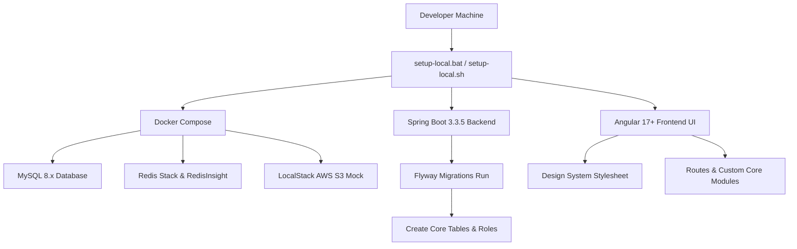

# ShutterFlow: Sprint 1 Plan — Project Setup & Core Infrastructure

## 🎯 Sprint Goal
Establish a bulletproof, highly optimized, multi-tenant monorepo architecture (Spring Boot backend + Angular frontend + React Native mobile client) with fully configured database migrations, local S3/Redis container instances, standard transactional email capabilities, CI/CD foundations, and a one-click local bootstrapping script that runs in under 5 minutes.

---

## 🛠️ Tech Stack & Services
- **Backend Framework**: Spring Boot 3.3.5, Java JDK 21.
- **Frontend Framework**: Angular 17+ Standalone architecture.
- **Relational Datastore**: MySQL 8.x with persistent volumes.
- **In-Memory Store**: Redis Stack (with RedisInsight visual console on port `8001`).
- **Cloud Simulation**: LocalStack simulating AWS S3 locally on port `4566`.
- **Database Migrations**: Flyway Core & Flyway MySQL.
- **Transactional Mail**: SendGrid Java SDK.

---

## 📊 Sprint Architecture Flow

---

## 📅 Day-by-Day (Daily) Detailed Plan

### 📌 Day 1: Monorepo Foundation & Workspace Partitioning
- **Goal**: Configure monorepo structure, nested git settings, and primary developer documentation.
- **Technical Steps**:
  - Scaffold root workspace directories: `/backend`, `/frontend`, and `/mobile`.
  - Create standard nested [.gitignore](file:///c:/Users/amrit/shutterflow%20by%20ai/.gitignore) ensuring Maven targets, Gradle wrapper cache, `node_modules/`, AWS access keys, `.env` files, and dynamic lock outputs are never committed.
  - Create workspace [README.md](file:///c:/Users/amrit/shutterflow%20by%20ai/README.md) detailing prerequisites (JDK 21, Docker, Node.js), monorepo folder maps, and development principles.

### 📌 Day 2: Spring Boot 3.3.5 Core Integration
- **Goal**: Bootstrap a Java 21 Spring Boot maven/gradle project skeleton with essential security, web, caching, and validation dependencies.
- **Technical Steps**:
  - Update [build.gradle](file:///c:/Users/amrit/shutterflow%20by%20ai/backend/build.gradle) containing Spring Boot `3.3.5` and `io.spring.dependency-management` `1.1.7` for absolute Gradle 9.4.1 runtime compatibility.
  - Configure root package `com.shutterflow` and primary boot class [ShutterFlowApplication.java](file:///c:/Users/amrit/shutterflow%20by%20ai/backend/src/main/java/com/shutterflow/ShutterFlowApplication.java).
  - Map Domain-Driven folders: `core/studio`, `core/user`, `core/client`, `core/pricing`, `core/common`.
  - Create unified REST envelopes [ApiResponse.java](file:///c:/Users/amrit/shutterflow%20by%20ai/backend/src/main/java/com/shutterflow/core/common/ApiResponse.java) and exception catchers [GlobalExceptionHandler.java](file:///c:/Users/amrit/shutterflow%20by%20ai/backend/src/main/java/com/shutterflow/core/common/GlobalExceptionHandler.java).

### 📌 Day 3: Local Infrastructure Composition via Docker
- **Goal**: Establish container virtualization for local MySQL datastores, Redis stack caches, and LocalStack S3 simulations.
- **Technical Steps**:
  - Write [docker-compose.yml](file:///c:/Users/amrit/shutterflow%20by%20ai/docker-compose.yml) exposing MySQL on port `3306`, Redis Stack on port `6379`/`8001`, and LocalStack on port `4566`.
  - Add robust health check parameters for each container to coordinate start dependencies.
  - Map external persistent volumes (`mysql-data`, `redis-data`, `localstack-data`) so local development states persist across container restarts.

### 📌 Day 4: Multi-Tenant Schema Migrations (Flyway)
- **Goal**: Model the relational MySQL schema and configure baseline Flyway migrations.
- **Technical Steps**:
  - Formulate Flyway migration script [V1__init_schema.sql](file:///c:/Users/amrit/shutterflow%20by%20ai/backend/src/main/resources/db/migration/V1__init_schema.sql).
  - Create initial tables: `studios`, `studio_settings`, `users`, `clients`, `client_contacts`, and `packages`.
  - Implement dynamic indexing on fields that are frequently queried (e.g. `subdomain`, composite indices `(email, studio_id)`).
  - Enable Flyway locations within Spring Boot's properties.

### 📌 Day 5: AWS S3 & CloudFront Photo Store Integration
- **Goal**: Set up S3 file uploading capabilities, pre-signed short-lived read URLs, and thumbnail resizing pipelines.
- **Technical Steps**:
  - Integrate Java AWS S3 SDK. Map credentials securely via properties.
  - Create an `S3Service` with helper methods:
    - `uploadFile(String key, byte[] bytes, String contentType)`
    - `generatePreSignedUrl(String key, Duration expiration)`
    - `deleteFile(String key)`
  - Direct local environments to bypass real AWS cloud instances and target `http://localhost:4566` (LocalStack Edge).

### 📌 Day 6: SendGrid Transactional Mail Engine
- **Goal**: Write asynchronous email dispatch wrappers utilizing HTML template bindings.
- **Technical Steps**:
  - Integrate SendGrid Java SDK wrapper.
  - Set up dynamic, responsive HTML base layouts (verification alerts, password resets, payment notifications).
  - Build `EmailService` utilizing Spring's `@Async` annotation. Ensures REST controllers return responses immediately while dispatch runs on background thread pool pools.

### 📌 Day 7: Multi-Environment Profile Configurations
- **Goal**: Segment application configurations into isolated dev, test, staging, and production properties profiles.
- **Technical Steps**:
  - Populate [application-dev.yml](file:///c:/Users/amrit/shutterflow%20by%20ai/backend/src/main/resources/application-dev.yml) pointing to local docker endpoints, setting JPA logging features.
  - Populate [application-test.yml](file:///c:/Users/amrit/shutterflow%20by%20ai/backend/src/main/resources/application-test.yml) linking to H2 in-memory structures and disabling caching to keep testing execution fast and isolated.
  - Define custom CORS filters to dynamically validate client requests depending on loaded profile profiles.

### 📌 Day 8: Continuous Integration (CI/CD) Workflow
- **Goal**: Build automated quality validation gates utilizing GitHub Action pipelines.
- **Technical Steps**:
  - Write standard workflow file [.github/workflows/ci-cd.yml](file:///c:/Users/amrit/shutterflow%20by%20ai/.github/workflows/ci-cd.yml).
  - Configure compilation checks, caching routines for Gradle dependencies, execute Spring Boot test profiles, and report failures.

### 📌 Day 9: One-Click Bootstrapper Automation
- **Goal**: Create batch and shell launchers so other developers can boot the monorepo locally in seconds.
- **Technical Steps**:
  - Write [setup-local.bat](file:///c:/Users/amrit/shutterflow%20by%20ai/setup-local.bat) for Windows systems.
  - Write [setup-local.sh](file:///c:/Users/amrit/shutterflow%20by%20ai/setup-local.sh) for Unix/Mac systems.
  - Scripts must start containers, execute migrations, compile Gradle, run tests, install npm dependencies, and start servers.

### 📌 Day 10: Performance Audits & Sprint Release
- **Goal**: Run load checks on local environments, review logs, and complete Sprint 1 Definition of Done (DoD).
- **Technical Steps**:
  - Perform test checkouts. Run automated test commands: `./gradlew test --no-daemon`.
  - Validate S3 and mail logging systems. Compile final reports and present metrics.

---

## 🧪 Sprint 1 Definition of Done (DoD)
- [ ] Code builds without errors (`./gradlew build -x test`).
- [ ] All unit and integration test assertions pass successfully (`./gradlew test`).
- [ ] Docker compose launches all 3 local dependencies with healthy statuses.
- [ ] Base flyway database migrations execute and build 6 core relational tables cleanly.
- [ ] One-click bootstrapper script clones and runs the entire stack in under 5 minutes.
