# ShutterFlow: Sprint 10 Plan — Stripe Payment Integration

## 🎯 Sprint Goal
Construct a secure, real-time Stripe payment integration allowing photographers to receive credit/debit card payments online. The system must create Stripe PaymentIntents, reconcile payments using resilient webhooks (handling checkout confirmations, failures, and refunds), track client-side payments via custom Stripe Elements, support structured instalment payment plans, automate payment reminder emails, and compile revenue metrics on a reconciliation dashboard.

---

## 🛠️ Tech Stack & Services
- **Stripe Gateway**: Stripe Java SDK (incorporating webhook signature verification).
- **Payment Security**: PCI-DSS compliant Stripe Elements integration.
- **Relational Datastore**: MySQL 8.x storing payment transactions and webhook logs.
- **Notifications**: SendGrid Java SDK delivering automated receipts and reminders.

---

## 📊 Stripe Webhook Reconciliation Flow

```mermaid
sequenceDiagram
    participant Client as Client Browser (Stripe Elements)
    participant Stripe as Stripe Gateway
    participant API as ShutterFlow API
    participant DB as MySQL Database
    
    Client->>Stripe: Submit Credit Card Details
    Stripe->>Client: Authorize Payment (3D Secure)
    Stripe-->>API: POST Webhook: payment_intent.succeeded
    rect rgb(20, 24, 35)
        note right of API: Webhook Listener & Signature Verification
        API->>API: Verify Stripe-Signature header
        API->>DB: Open Transaction
        API->>DB: Save Payment Transaction Record
        API->>DB: Recalculate Invoice Balance & Total Client Spend
        API->>DB: Advance Invoice Status (PAID or PARTIALLY_PAID)
        API->>DB: Commit Transaction
    end
    API->>Stripe: HTTP 200 OK (Acknowledge)
    API-->>Client: Send Transaction Receipt Email via SendGrid
```

---

## 📅 Day-by-Day (Daily) Detailed Plan

### 📌 Day 1: Stripe Integration Setup & Mapped Transactions
- **Goal**: Import the Stripe Java SDK, configure environment secrets, and structure the transaction schema.
- **Technical Steps**:
  - Add `stripe-java` dependency to backend.
  - Implement `PaymentTransaction.java` JPA entity.
  - Include fields: transaction ID, Stripe charge/payment intent ID, amount, currency, transaction status, timestamp, and a `@ManyToOne` invoice mapping.

### 📌 Day 2: Payment Intent API Endpoint
- **Goal**: Create endpoints that instantiate Stripe PaymentIntents, passing pricing metrics.
- **Technical Steps**:
  - Build endpoints `/payments/create-intent` accepting invoice ID and optional installment indexes.
  - Call the Stripe SDK, generating a `PaymentIntent` specifying the correct amount, currency (e.g. AUD), and client metadata.
  - Return the client secret to initialize frontend Stripe Elements.

### 📌 Day 3: Resilient Webhook Endpoints & Signature Security
- **Goal**: Build a secure webhook endpoint to receive Stripe notifications asynchronously.
- **Technical Steps**:
  - Create the POST endpoint `/public/payments/stripe-webhook`.
  - Validate the `Stripe-Signature` header using the configured webhook secret key to prevent spoofing.
  - Log raw webhook events inside a `StripeWebhookLog` table to assist with audits.

### 📌 Day 4: Webhook Event Handlers & Database Reconciliation
- **Goal**: Process payment confirmations and update database states transactionally.
- **Technical Steps**:
  - Write parser utilities for events: `payment_intent.succeeded` and `charge.refunded`.
  - On successful payment, retrieve invoice records, record payments, recalculate balances, and transition statuses (e.g. `SENT` → `PAID`).
  - Publish `PaymentCompletedEvent` to trigger total client spend recalculation.

### 📌 Day 5: Refund Processing Operations
- **Goal**: Allow studio owners to trigger partial or complete refunds from ShutterFlow.
- **Technical Steps**:
  - Build endpoints `/payments/{id}/refund` secured by `STUDIO_OWNER` permissions.
  - Call the Stripe API requesting refunds, and update transaction records upon receiving Stripe's webhook confirmations.

### 📌 Day 6: Structured Instalment Payment Plans
- **Goal**: Permit clients to clear invoice balances over multiple scheduled payments.
- **Technical Steps**:
  - Support partial payments linked to an invoice's terms.
  - Track payments against specific milestones and transition invoice states (e.g., `PARTIALLY_PAID` after deposit, `PAID` after final balance).

### 📌 Day 7: Automated Payment Reminders
- **Goal**: Implement workers reminding clients of upcoming invoice due dates.
- **Technical Steps**:
  - Write a daily Spring `@Scheduled` worker finding active invoices due in exactly 3 days.
  - Automatically dispatch branded reminder emails with payment links.

### 📌 Day 8: Automated Payment Receipts
- **Goal**: Email professional, beautifully formatted transaction receipts immediately after payments clear.
- **Technical Steps**:
  - Write a transaction-driven payment listener.
  - On invoice payment completions, compile receipt details and dispatch an HTML email using SendGrid.

### 📌 Day 9: Revenue Reconciliation Dashboard
- **Goal**: Compile financial analytics summaries detailing total revenue, outstanding balances, and recent payments.
- **Technical Steps**:
  - Write optimized JPQL/SQL aggregations gathering studio financial metrics.
  - Expose statistics `/finance/reconciliation` reporting earnings by month or photographer.

### 📌 Day 10: E2E Stripe Payments Integration Tests
- **Goal**: Write tests verifying webhook signatures, payment state reconciliations, and Sprint 10 DoD.
- **Technical Steps**:
  - Write MockMvc integration tests:
    - Webhook endpoints verify signatures correctly and reject invalid signatures.
    - `payment_intent.succeeded` triggers successful invoice status advancements.
    - Invoices with multiple payments reconcile partial amounts correctly.

---

## 🧪 Sprint 10 Definition of Done (DoD)
- [ ] Stripe PaymentIntents initialize and return client secrets accurately.
- [ ] Webhook listener verifies Stripe signatures and logs raw events safely.
- [ ] Confirmed checkouts trigger automatic invoice state transitions.
- [ ] Instalment plans allow multiple payments to clear a single invoice.
- [ ] Scheduled reminder scripts trigger emails 3 days prior to due dates.
- [ ] All integration tests pass successfully (`./gradlew test`).

follow shutterflow_sprint_plan.html
