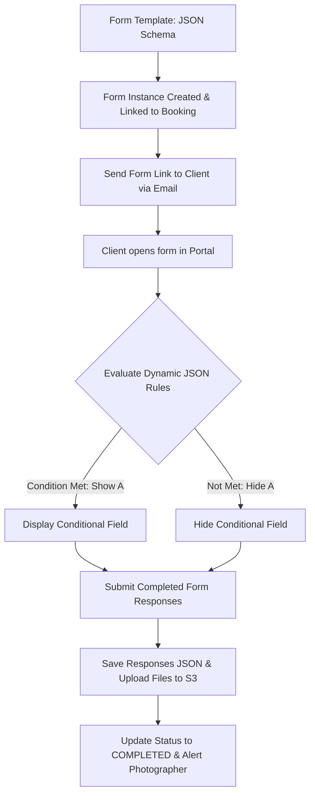

# ShutterFlow: Sprint 12 Plan — Questionnaires & Custom Forms

## 🎯 Sprint Goal
Construct a dynamic form building and customer questionnaire framework. This system must enable studios to manage reusable questionnaire templates, support multiple field structures (text inputs, checkbox lists, dates, file uploads, and digital signatures), capture conditional questionnaire logic, deliver invitation links via email, track completion percentages, automatically trigger forms 2 weeks before scheduled events, and attach completed answers to the associated booking records.

---

## 🛠️ Tech Stack & Services
- **Backend Architecture**: Spring Boot 3.3.5, Spring Data JPA.
- **Form Schema Storage**: MySQL 8.x using JSON data types to represent dynamic form questions.
- **Notifications**: SendGrid Java SDK delivering form access links.
- **File Ingestion**: AWS S3 supporting questionnaire document uploads.

---

## 📊 Form Builder Schema & Response Tracking

---

## 📅 Day-by-Day (Daily) Detailed Plan

### 📌 Day 1: Questionnaire Schema & JSON Mapping
- **Goal**: Model customizable forms and define database tables.
- **Technical Steps**:
  - Implement `FormTemplate.java` JPA entity.
  - Structure question configurations as JSON data rows (containing field type: `TEXT`, `CHOICE`, `DATE`, `FILE`, `SIGNATURE`).
  - Add standard templates for Wedding, Portrait, Newborn, and Commercial shoots in database migrations.

### 📌 Day 2: Form Builder API Endpoints
- **Goal**: Build CRUD endpoints to manage templates.
- **Technical Steps**:
  - Write REST controllers GET/POST/PUT/DELETE `/forms/templates` secured with method authorizations.
  - Enforce schema validations, ensuring JSON structures contain correct labels, field types, and unique keys.

### 📌 Day 3: Form Instances & Booking Associations
- **Goal**: Create active form instances linked to bookings.
- **Technical Steps**:
  - Implement `Questionnaire.java` entity linking to a specific `Booking` and `Client`.
  - Include fields: status (PENDING, IN_PROGRESS, COMPLETED), expiration, and JSON storage for responses.

### 📌 Day 4: Conditional Form Field Logic
- **Goal**: Parse conditional logic rules dynamically.
- **Technical Steps**:
  - Implement logical trigger properties in question DTO schemas: e.g., "Show question B only if question A's value equals 'Yes'".
  - Expose rules in REST payloads to enable the frontend form engine to adjust fields dynamically.

### 📌 Day 5: Questionnaire Dispatch Engine
- **Goal**: Build services to email form access links to clients.
- **Technical Steps**:
  - Create endpoints enabling manual questionnaire triggers.
  - Generate secure tokens and email access links (`/portal/forms/{token}`) using SendGrid templates.

### 📌 Day 6: File Ingestion in Questionnaires
- **Goal**: Enable clients to upload timeline spreadsheets or inspiration images directly to forms.
- **Technical Steps**:
  - Create questionnaire upload endpoints `/public/forms/{token}/upload` accepting multipart file formats.
  - Upload files directly into S3 directories: `/studios/{studioId}/forms/{formId}/uploads/`.

### 📌 Day 7: Response Submission & Completeness Tracking
- **Goal**: Validate and record completed forms, updating progress indicators.
- **Technical Steps**:
  - Implement POST endpoints `/public/forms/{token}/submit` saving form answers.
  - Analyze submitted data to calculate overall form completeness percentages, advancing status to `COMPLETED` once complete.

### 📌 Day 8: Automated Scheduling Triggers
- **Goal**: Set up scheduled jobs to dispatch forms 2 weeks before scheduled events.
- **Technical Steps**:
  - Build a daily Spring `@Scheduled` cron job finding bookings scheduled in exactly 14 days.
  - Automatically instantiate templates and dispatch email alerts to clients.

### 📌 Day 9: Post-Shoot Feedback Templates
- **Goal**: Model and support feedback forms following event completions.
- **Technical Steps**:
  - Structure feedback templates as distinct form categories.
  - Link post-shoot surveys to automatic triggers executing 3 days after bookings are marked `COMPLETED`.

### 📌 Day 10: E2E Form Builder Integration Tests
- **Goal**: Write tests verifying form builder APIs, schedulers, and Sprint 12 DoD.
- **Technical Steps**:
  - Write MockMvc integration tests verifying:
    - Custom JSON templates save and serialize dynamic questionnaire layouts correctly.
    - Schedulers trigger questionnaire emails precisely 14 days before events.
    - Missing required fields blocks submission, returning validation errors.

---

## 🧪 Sprint 12 Definition of Done (DoD)
- [ ] Questionnaire templates save and parse dynamic JSON schemas correctly.
- [ ] Active questionnaires associate securely with individual booking records.
- [ ] Client responses and file uploads are saved and archived in S3.
- [ ] Scheduled cron jobs dispatch forms 2 weeks before events automatically.
- [ ] Status updates trigger real-time photographer notifications upon submission.
- [ ] All integration tests pass successfully (`./gradlew test`).

follow shutterflow_sprint_plan.html
