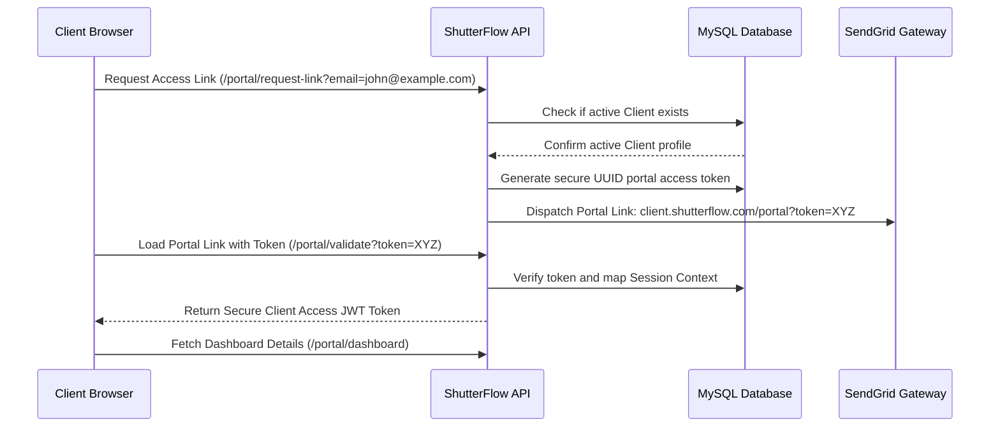

# ShutterFlow: Sprint 13 Plan — Client Portal Core

## 🎯 Sprint Goal
Construct a premium, fully-branded, password-less client portal interface. The portal must support cryptographically secure token-based logins (via magic links), resolve custom subdomain mappings or studio slug indicators (`client.shutterflow.com/studioslug`), compile a comprehensive client dashboard summarizing upcoming events, current galleries, and outstanding invoice logs, integrate real-time countdown widgets, allow clients to edit their contact details, and feature an in-portal alert/notification bell.

---

## 🛠️ Tech Stack & Services
- **Backend Architecture**: Spring Boot 3.3.5, Spring Security (magic token validations).
- **Authentication**: JWT-based session scopes tailored for client roles.
- **Relational Datastore**: MySQL 8.x tracing portal tokens and portal notification records.
- **Notifications**: SendGrid delivering secure magic access tokens.

---

## 📊 Client Portal Password-Less Access Flow

---

## 📅 Day-by-Day (Daily) Detailed Plan

### 📌 Day 1: Portal Token-Based Authentication
- **Goal**: Establish the secure magic-token validation endpoints to provide password-less entry.
- **Technical Steps**:
  - Implement `/portal/validate` accepting a secure UUID token.
  - On validation, resolve the client's email, check role permissions, and issue a short-lived client JWT session token.

### 📌 Day 2: Custom Subdomain & Studio Branding Resolution
- **Goal**: Render portal styling dynamically, resolving logos and colors based on studio settings.
- **Technical Steps**:
  - Implement dynamic lookup endpoints `/public/portal/studios/{studioSlug}` returning brand attributes.
  - Expose logo S3 keys, primary/secondary hex color codes, and customized fonts.

### 📌 Day 3: Portal Dashboard API Aggregator
- **Goal**: Consolidate booking details, invoices, and galleries into a single endpoint.
- **Technical Steps**:
  - Create the endpoint `/portal/dashboard` secured with client permissions.
  - Query H2/MySQL database to aggregate the client's active events, galleries, and outstanding invoices.

### 📌 Day 4: Event Countdown Metrics
- **Goal**: Provide real-time event countdown calculations.
- **Technical Steps**:
  - Write date duration calculators comparing current times against scheduled booking start dates.
  - Return precise countdown metrics (days, hours, minutes) in the dashboard payload.

### 📌 Day 5: Booking Details and Timeline View
- **Goal**: Allow clients to inspect scheduled event locations, dates, and package selections.
- **Technical Steps**:
  - Create endpoint `/portal/bookings/{id}` validating that the requested booking belongs to the caller.
  - Expose venue addresses, starting times, and assigned photographer profiles.

### 📌 Day 6: Self-Service Contact Details Editor
- **Goal**: Allow clients to maintain and update their primary contact information directly.
- **Technical Steps**:
  - Create `/portal/profile` PUT endpoints updating contact names, emails, and phone records.
  - Validate parameters before saving changes to the `clients` table.

### 📌 Day 7: In-Portal Notification Center
- **Goal**: Implement a database table to record portal notifications (e.g. "Gallery ready", "Invoice due").
- **Technical Steps**:
  - Implement `PortalNotification.java` entity tracking client targets, messages, read states, and timestamps.
  - Create REST routes checking active alerts.

### 📌 Day 8: Share Portal Link Mechanism
- **Goal**: Enable clients to share secure portal links with family members or wedding planners.
- **Technical Steps**:
  - Build endpoints generating guest access tokens with read-only permissions.
  - Allow guest access to galleries and dashboards while locking financial/payment pathways.

### 📌 Day 9: Portal Security Audit
- **Goal**: Conduct access checks, ensuring client tokens cannot access administrator data.
- **Technical Steps**:
  - Write security test rules, ensuring client tokens attempting to fetch backend studio settings are blocked with HTTP 403.
  - Enforce SSL requirements and prevent parameter-tampering attacks on client details.

### 📌 Day 10: E2E Client Portal Integration Tests
- **Goal**: Write tests verifying magic token lookups, dashboard endpoints, and Sprint 13 DoD.
- **Technical Steps**:
  - Write MockMvc integration tests verifying:
    - Valid magic tokens issue correct JWT sessions.
    - Dashboard calls return consolidated lists of active bookings and invoices.
    - Attempting to access dashboard details with invalid tokens is blocked.

---

## 🧪 Sprint 13 Definition of Done (DoD)
- [ ] Valid magic tokens authorize secure client dashboard access.
- [ ] Dashboards render studio logo and color metadata dynamically.
- [ ] Event countdown calculations return accurate time intervals.
- [ ] Clients can update their contact details in the profile system.
- [ ] In-portal alerts log notifications and track read statuses.
- [ ] All integration tests pass successfully (`./gradlew test`).

follow shutterflow_sprint_plan.html
