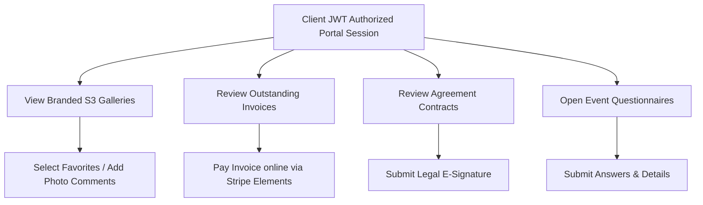

# ShutterFlow: Sprint 14 Plan — Portal Galleries, Invoices & Forms

## 🎯 Sprint Goal
Construct the core functional layers of the client portal, enabling clients to view high-resolution photo galleries, select favorites, comment on photos, download single or zipped assets, review invoices, pay outstanding invoice balances online via Stripe Elements, view contract documents, submit e-signatures, and complete event questionnaires.

---

## 🛠️ Tech Stack & Services
- **Payment Processing**: Stripe Webhook endpoints and Stripe Elements.
- **E-Signature Engine**: SVG/Canvas-based e-signature tracking.
- **Cloud Storage**: AWS S3 retrieving galleries and archiving signed contracts.
- **Relational Datastore**: MySQL 8.x storing favorite selections, comments, and completed forms.

---

## 📊 Client Portal Actions Lifecycle

---

## 📅 Day-by-Day (Daily) Detailed Plan

### 📌 Day 1: Portal Gallery Viewer & Asset Streaming
- **Goal**: Build optimized endpoints for streaming photos within the client portal.
- **Technical Steps**:
  - Create secure portal endpoints GET `/portal/galleries` retrieving active client galleries.
  - Return S3 paths for pre-signed thumbnails (300px) and web-ready copies (1080px).

### 📌 Day 2: Photo Selection & Favorites Tracking
- **Goal**: Let clients choose favorite photos and organize them in a favorites list.
- **Technical Steps**:
  - Implement `PhotoFavorite.java` entity linking clients to specific gallery photos.
  - Create POST/DELETE endpoints `/portal/favorites` allowing clients to add or remove favorite marks.

### 📌 Day 3: Interactive Photo Comments
- **Goal**: Enable clients to write comments on individual photos to suggest editing tweaks.
- **Technical Steps**:
  - Implement `PhotoComment.java` entity.
  - Create GET/POST endpoints `/portal/photos/{id}/comments` to record client feedback.

### 📌 Day 4: Zip Delivery & Downloads
- **Goal**: Let clients trigger direct file downloads and zip archives from the portal.
- **Technical Steps**:
  - Build endpoints checking client access keys and redirecting requests to pre-signed S3 download URLs.
  - Support full gallery zip generation download requests.

### 📌 Day 5: Portal Invoicing View
- **Goal**: Expose a clean, branded invoice view in the client portal.
- **Technical Steps**:
  - Create `/portal/invoices` endpoints returning line items, due dates, outstanding balances, and installment options.
  - Block access if invoices are in a `DRAFT` state.

### 📌 Day 6: Embedded Stripe Elements Payments
- **Goal**: Allow clients to pay outstanding invoice balances directly from the portal.
- **Technical Steps**:
  - Implement dynamic checkout endpoints creating Stripe PaymentIntents.
  - Integrate Stripe Elements flows, supporting card transactions that clear balances instantly.

### 📌 Day 7: E-Signature Submission API
- **Goal**: Enable clients to sign contracts and legal agreements in the portal.
- **Technical Steps**:
  - Create contract review endpoints `/portal/contracts/{id}`.
  - Capture e-signature vectors, IP addresses, and timestamps, advancing contract states to `SIGNED`.

### 📌 Day 8: Dynamic Questionnaire Submissions
- **Goal**: Expose scheduled event questionnaires to let clients fill out details.
- **Technical Steps**:
  - Create questionnaire retrieval and answer submission endpoints `/portal/questionnaires/{id}`.
  - Validate and save submitted JSON answers in the database, notifying the photographer.

### 📌 Day 9: Receipt Document Download
- **Goal**: Provide automated receipt PDF downloads after invoices are settled.
- **Technical Steps**:
  - Create `/portal/invoices/{id}/receipt` endpoints generating transaction summaries.
  - Render receipt layouts and convert them into printable PDF streams.

### 📌 Day 10: E2E Portal Integration Tests
- **Goal**: Write tests verifying e-signatures, payments, favorite selections, and Sprint 14 DoD.
- **Technical Steps**:
  - Write MockMvc integration tests verifying:
    - Favorites selections save and link correctly.
    - Contract signings capture signee IP addresses and transition states to `SIGNED`.
    - Stripe PaymentIntent endpoint loads correct outstanding balances.

---

## 🧪 Sprint 14 Definition of Done (DoD)
- [ ] Portal endpoints retrieve S3 photo assets and support single downloads.
- [ ] Favorite tags and photo comment selections save correctly in the database.
- [ ] Embedded payment endpoints instantiate Stripe PaymentIntents securely.
- [ ] Contract signing endpoints record signatures and capture signee IP addresses.
- [ ] Questionnaires accept dynamic JSON answers and update booking records.
- [ ] All integration tests pass successfully (`./gradlew test`).

follow shutterflow_sprint_plan.html
