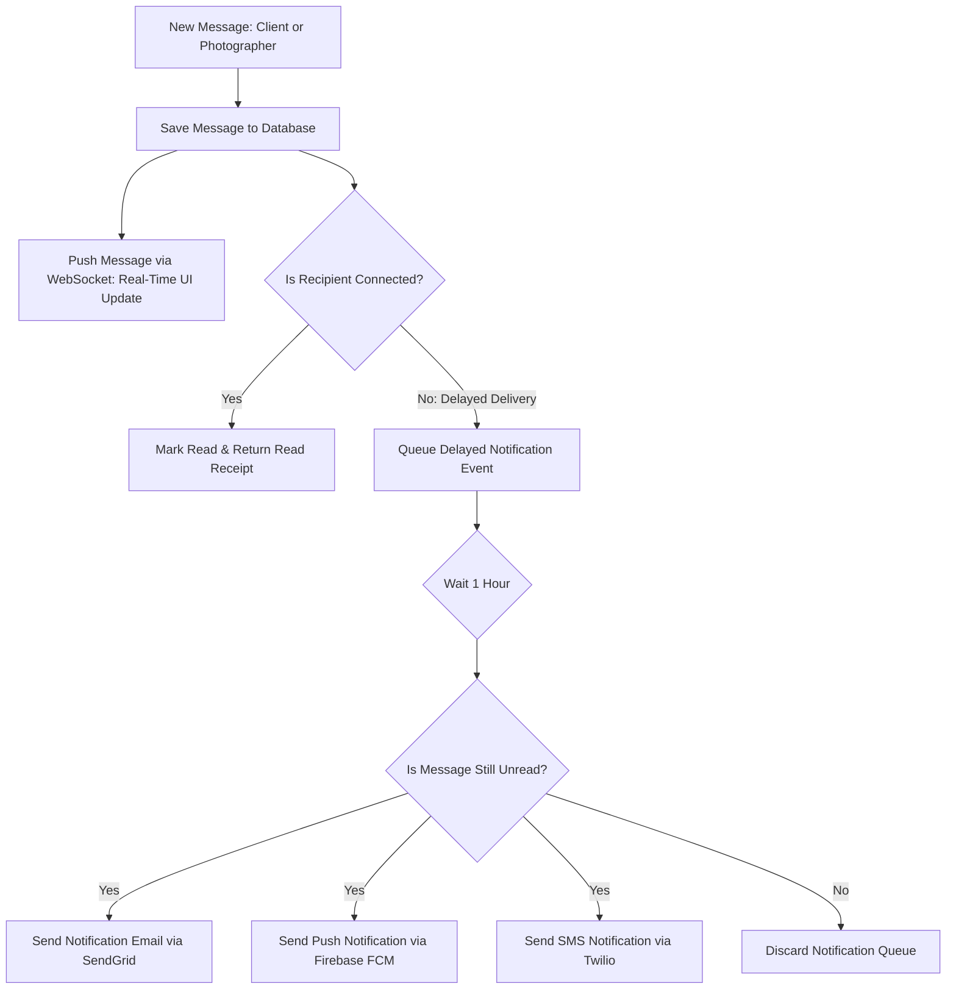

# ShutterFlow: Sprint 15 Plan — Messaging & Notifications Engine

## 🎯 Sprint Goal
Construct a secure, real-time client-to-photographer messaging and multi-channel notification engine. This engine must manage threaded message channels per booking, support attachments (file sharing), track read receipts, dispatch email alerts for unread messages, send push notifications using Firebase, send SMS updates using Twilio, and provide customizable notification settings.

---

## 🛠️ Tech Stack & Services
- **Real-Time Communication**: Spring WebSocket / STOMP.
- **Push Notification Gateway**: Firebase Cloud Messaging (FCM) Java Admin SDK.
- **SMS Gateway**: Twilio Java Helper SDK.
- **Transactional Mail**: SendGrid (dispatching unread message digests).
- **Blob Storage**: AWS S3 (hosting file attachments for chat messages).

---

## 📊 Messaging & Notification Event Dispatcher

---

## 📅 Day-by-Day (Daily) Detailed Plan

### 📌 Day 1: Threaded Messaging Entities
- **Goal**: Model real-time threaded chat systems and define database tables.
- **Technical Steps**:
  - Implement `MessageThread.java` and `ChatMessage.java` JPA entities.
  - Link message threads directly to `Booking` records to keep discussions organized.
  - Track sender ID, recipient ID, message body, attachment S3 keys, and read flags.

### 📌 Day 2: WebSocket STOMP Configurations
- **Goal**: Configure WebSocket STOMP endpoints to support real-time message transfers.
- **Technical Steps**:
  - Write `WebSocketConfig.java` defining message broker prefixes (`/topic`, `/app`) and registry endpoints `/ws`.
  - Secure STOMP connections using JWT token authentication interceptors.

### 📌 Day 3: Chat Controller & Read Receipts
- **Goal**: Implement REST and STOMP message endpoints and track read receipts.
- **Technical Steps**:
  - Create `ChatController` with endpoints to send messages, load history, and mark messages as read.
  - Trigger WebSocket read-receipt broadcasts when a client reads a message.

### 📌 Day 4: Chat File Sharing & S3 Storage
- **Goal**: Let users upload documents and images in chat conversations.
- **Technical Steps**:
  - Build chat upload endpoints `/chat/upload` saving attachments in S3.
  - Generate secure, temporary pre-signed download URLs for chat attachments.

### 📌 Day 5: Firebase Push Notification Engine (FCM)
- **Goal**: Implement mobile and web push notifications via FCM.
- **Technical Steps**:
  - Configure the Firebase Admin SDK using credential properties.
  - Create a push notification service delivering alerts when events occur (e.g., "New message received").

### 📌 Day 6: Twilio SMS Notification Service
- **Goal**: Add SMS notifications to deliver time-sensitive updates.
- **Technical Steps**:
  - Integrate the Twilio Java helper library.
  - Write SMS delivery methods for urgent alerts, such as contract signatures or outstanding payments.

### 📌 Day 7: Delayed Email Notification Schedulers
- **Goal**: Send email digests for unread messages if they aren't read within 1 hour.
- **Technical Steps**:
  - Build asynchronous email queues.
  - Write background tasks scanning for unread messages older than 1 hour and email digests via SendGrid.

### 📌 Day 8: Dynamic Notification Center
- **Goal**: Create an in-app notification center compiling history alerts for both photographers and clients.
- **Technical Steps**:
  - Implement `Notification.java` entity.
  - Create endpoints to load, count, and dismiss notifications.

### 📌 Day 9: User Notification Preferences
- **Goal**: Let users customize which notifications they receive (Email, SMS, Push).
- **Technical Steps**:
  - Implement `NotificationPreference.java` mapping user configuration choices.
  - Verify these settings before dispatching SMS or email notifications.

### 📌 Day 10: Messaging & Notification Integration Tests
- **Goal**: Write tests verifying WebSocket connections, delivery schedulers, and Sprint 15 DoD.
- **Technical Steps**:
  - Write MockMvc and WebSocket integration tests verifying:
    - Chat message endpoints save records and broadcast payloads correctly.
    - Sending messages to unread queues schedules email alerts.
    - Notification preferences block specific channels dynamically.

---

## 🧪 Sprint 15 Definition of Done (DoD)
- [ ] Threaded chat messages persist in databases and link to bookings.
- [ ] WebSocket STOMP endpoints broadcast messages in real time.
- [ ] FCM push notifications and Twilio SMS deliver alerts successfully.
- [ ] Unread message digests are emailed automatically after 1 hour.
- [ ] Users can customize their notification preferences in their settings.
- [ ] All integration tests pass successfully (`./gradlew test`).

follow shutterflow_sprint_plan.html
