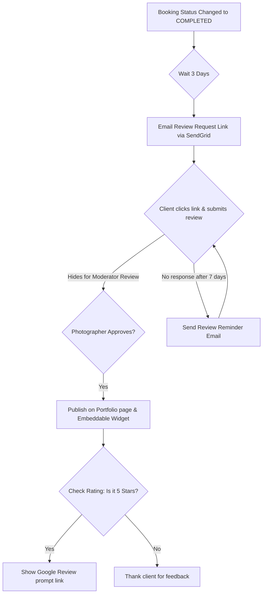

# ShutterFlow: Sprint 16 Plan — Reviews & Reputation Management

## 🎯 Sprint Goal
Construct a robust customer review and reputation management engine. The system must automatically email review requests 3 days after bookings are completed, capture 1-to-5 star ratings, support review moderation (approval flows), display reviews on public portfolios, let photographers write replies, prompt clients to leave Google reviews, provide embeddable review widgets, and send review reminder emails if there's no response after 7 days.

---

## 🛠️ Tech Stack & Services
- **Backend Architecture**: Spring Boot 3.3.5, Spring Data JPA.
- **Scheduled Services**: Spring Task Scheduling (handling delayed triggers).
- **Communication Gateway**: SendGrid delivering request forms and reminders.
- **Public Embedding**: Public JSON endpoints for Javascript widget overlays.

---

## 📊 Automated Review Gathering Lifecycle

---

## 📅 Day-by-Day (Daily) Detailed Plan

### 📌 Day 1: Review Entity & Schema Mapping
- **Goal**: Model customer reviews and define database tables.
- **Technical Steps**:
  - Implement `Review.java` JPA entity.
  - Link reviews to `Studio`, `Photographer`, `Booking`, and `Client`.
  - Include fields: star rating (1-5), comments, status (PENDING, APPROVED, SPAM), featured flag, photographer reply, and timestamps.

### 📌 Day 2: Review Submission API
- **Goal**: Create public review submission endpoints.
- **Technical Steps**:
  - Create the public POST endpoint `/public/reviews/submit` accepting a secure review token.
  - Validate parameters, ensuring rating integers are strictly between 1 and 5 and comments are sanitized.

### 📌 Day 3: Automated Review Requests
- **Goal**: Automatically schedule and email review request links 3 days after bookings are completed.
- **Technical Steps**:
  - Implement a daily Spring `@Scheduled` job finding bookings completed exactly 3 days ago that don't have review requests.
  - Generate secure tokens and email request links using SendGrid.

### 📌 Day 4: Review Reminder Cron
- **Goal**: Send one-time reminder emails to clients who haven't left reviews after 7 days.
- **Technical Steps**:
  - Write a scheduled job looking up pending review requests sent exactly 7 days ago.
  - Dispatch a friendly reminder email using SendGrid.

### 📌 Day 5: Review Moderation & Reply Flow
- **Goal**: Let photographers approve reviews and write replies before publishing.
- **Technical Steps**:
  - Build endpoints `/reviews/{id}/approve` and `/reviews/{id}/reply` secured with photographer privileges.
  - Track photographer comments in the database.

### 📌 Day 6: Public Portfolio Integration
- **Goal**: Expose approved reviews on public portfolios.
- **Technical Steps**:
  - Create public endpoints `/public/photographers/{slug}/reviews` returning approved reviews.
  - Implement caching to optimize query performance for portfolio pages.

### 📌 Day 7: Google Review Redirect Prompts
- **Goal**: Prompt satisfied clients to leave Google reviews.
- **Technical Steps**:
  - Add Google Business profile fields in the `StudioSettings` table.
  - If a client leaves a 5-star review, return the Google Business link in the API response to prompt them to copy their review to Google.

### 📌 Day 8: Mapped Review Widgets
- **Goal**: Create embeddable review widgets that photographers can add to their websites.
- **Technical Steps**:
  - Create a public Javascript wrapper endpoint `/public/widgets/reviews.js` fetching approved reviews.
  - Stream a lightweight JSON representation of approved reviews.

### 📌 Day 9: Review Analytics & Metrics
- **Goal**: Compile review metrics, including average ratings and rating distributions.
- **Technical Steps**:
  - Write optimized JPQL/SQL aggregations computing average star ratings, counts by star level, and weekly trends.
  - Expose statistics `/reviews/analytics` in the photographer dashboard.

### 📌 Day 10: E2E Review Integration Tests
- **Goal**: Write tests verifying moderation flows, schedulers, portfolio lists, and Sprint 16 DoD.
- **Technical Steps**:
  - Write MockMvc integration tests verifying:
    - Review requests are emailed 3 days after event completions.
    - Non-approved reviews are excluded from public portfolio endpoints.
    - Rating inputs outside the 1-5 range return validation errors.

---

## 🧪 Sprint 16 Definition of Done (DoD)
- [ ] Review system supports 1-to-5 star ratings and photographer replies.
- [ ] Scheduled cron jobs email review requests 3 days after event completions.
- [ ] Review reminder emails are sent after 7 days if there's no response.
- [ ] Portfolio endpoints exclude pending reviews, displaying only approved ones.
- [ ] Google review prompts display links if clients submit 5-star ratings.
- [ ] All integration tests pass successfully (`./gradlew test`).

follow shutterflow_sprint_plan.html
