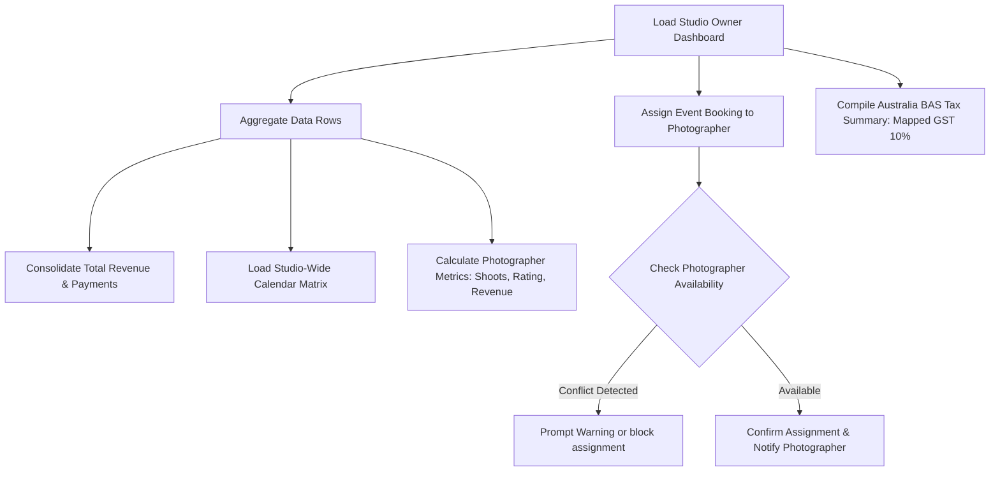

# ShutterFlow: Sprint 17 Plan — Studio Dashboard & Team Management

## 🎯 Sprint Goal
Construct a robust studio administration dashboard and team management panel. This dashboard must aggregate booking schedules, revenue metrics, photographer performance stats, and tax summary reports (assisting with Australia's BAS/GST filings), support team availability checks, let owners assign shoots to photographers, track commission splits, and support studio-wide announcements.

---

## 🛠️ Tech Stack & Services
- **Backend Architecture**: Spring Boot 3.3.5, Spring Data JPA.
- **Reporting Engine**: Dynamic JPQL queries and native SQL views for high-performance dashboards.
- **Caching**: Local memory/Redis caching for dashboard statistics.
- **Relational Datastore**: MySQL 8.x tracing team profiles and financial transactions.

---

## 📊 Studio Owner Aggregations & Team Dispatches

---

## 📅 Day-by-Day (Daily) Detailed Plan

### 📌 Day 1: Mapped Studio Metrics Entity
- **Goal**: Model studio administration metrics and design database aggregations.
- **Technical Steps**:
  - Write high-performance JPQL queries consolidating total bookings, clients, and revenue.
  - Implement caching rules to prevent heavy dashboard loads from slowing down the database.

### 📌 Day 2: Team Performance View
- **Goal**: Compile photographer performance metrics, including completed bookings, generated revenue, and average ratings.
- **Technical Steps**:
  - Write SQL group-by queries compiling photographer stats.
  - Expose performance metrics in the owner dashboard `/studio/team/performance`.

### 📌 Day 3: Custom Commission Mappings & Calculations
- **Goal**: Calculate and track photographer commissions based on customized split percentages.
- **Technical Steps**:
  - Implement `CommissionRecord.java` entity.
  - On invoice payment completions, automatically calculate commission amounts based on studio configurations (e.g. 70% studio, 30% photographer) and save records.

### 📌 Day 4: Booking Assignment Flow
- **Goal**: Let studio owners assign photographers and second shooters to bookings.
- **Technical Steps**:
  - Create `/bookings/{id}/assign` endpoints accepting photographer and second shooter user IDs.
  - Send email and in-app notifications to the assigned photographers.

### 📌 Day 5: Team Availability Calendar
- **Goal**: Build a team calendar view that checks photographer schedules before assigning bookings.
- **Technical Steps**:
  - Expose consolidated calendars overlaying schedules for all team members.
  - Return conflict alerts if owners attempt to assign a photographer to an overlapping event.

### 📌 Day 6: Studio Announcements Board
- **Goal**: Let studio owners post announcements and broadcast alerts to the team.
- **Technical Steps**:
  - Implement `Announcement.java` entity.
  - Expose endpoints to post, read, and dismiss announcements in the photographer portal.

### 📌 Day 7: Mapped Financial Reports
- **Goal**: Compile comprehensive monthly and annual financial reports, grouping earnings by photographer and booking category.
- **Technical Steps**:
  - Expose financial reporting endpoints `/finance/reports/revenue` returning seasonal comparisons and revenue summaries.

### 📌 Day 8: Australian BAS & GST Tax Summaries
- **Goal**: Compile tax summary reports (Australia BAS/GST) tracking collected taxes and net revenues.
- **Technical Steps**:
  - Expose tax reporting endpoints `/finance/reports/tax-summary`.
  - Calculate total collected GST (10%) and net revenue within selected date ranges.

### 📌 Day 9: Owner Control Center Controllers
- **Goal**: Implement REST endpoints secured with `STUDIO_OWNER` permissions.
- **Technical Steps**:
  - Write `StudioDashboardController` with methods requiring `@PreAuthorize("hasRole('STUDIO_OWNER')")`.
  - Sanitize responses to prevent standard users from accessing confidential financial details.

### 📌 Day 10: Studio Dashboard Integration Tests
- **Goal**: Write tests verifying commission calculations, role-based security, tax summaries, and Sprint 17 DoD.
- **Technical Steps**:
  - Write MockMvc integration tests verifying:
    - Standard photographers cannot load studio owner dashboards.
    - Commission calculations save the correct percentages during checkouts.
    - Australian BAS tax reports calculate GST totals correctly.

---

## 🧪 Sprint 17 Definition of Done (DoD)
- [ ] Dashboards aggregate bookings, clients, and revenue correctly.
- [ ] Photographer metrics calculate accurate totals for shoots, revenue, and ratings.
- [ ] Commission engine tracks and saves split balances.
- [ ] Bookings support photographer assignments and trigger notifications.
- [ ] Tax modules compile BAS-ready summaries, calculating GST accurately.
- [ ] All integration tests pass successfully (`./gradlew test`).

follow shutterflow_sprint_plan.html
