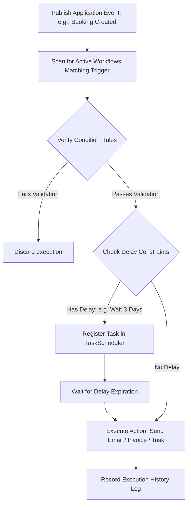

# ShutterFlow: Sprint 18 Plan — Workflow Automation Engine

## 🎯 Sprint Goal
Construct a powerful visual workflow automation engine that automates routine admin tasks. The system must support trigger-condition-action logic (handling events: booking creation, contract signings, payment confirmations), dispatch emails, send questionnaires, generate invoices, create tasks, process delay rules (e.g., waiting 3 days), maintain an execution history log, and send bulk email broadcasts.

---

## 🛠️ Tech Stack & Services
- **Backend Architecture**: Spring Boot 3.3.5, Spring Data JPA.
- **Event-Driven Messaging**: Spring ApplicationEvents (publishing trigger events).
- **Execution Scheduler**: Spring TaskScheduler (handling delayed automation tasks).
- **Relational Datastore**: MySQL 8.x storing workflow rules and execution logs.
- **Notifications**: SendGrid Java SDK delivering automated emails.

---

## 📊 Workflow Automation Logical Pipeline

---

## 📅 Day-by-Day (Daily) Detailed Plan

### 📌 Day 1: Workflow Configuration Schema
- **Goal**: Model custom automation workflows and define database tables.
- **Technical Steps**:
  - Implement `Workflow.java` JPA entity.
  - Link workflows to `Studio` workspaces under strict tenancy boundaries.
  - Include fields: name, description, trigger type (`BOOKING_CREATED`, `CONTRACT_SIGNED`, `PAYMENT_RECEIVED`, `DATE_BASED`), conditions, actions, and status (ACTIVE, INACTIVE).

### 📌 Day 2: Dynamic JSON Trigger-Condition-Action Mapping
- **Goal**: Model flexible trigger rules and action parameters using database JSON fields.
- **Technical Steps**:
  - Structure workflow steps: trigger attributes, condition rules (e.g. "if booking package equals 'Premium Wedding'"), and action arguments (e.g. "send questionnaire ID 5").
  - Map dynamic JSON fields using Jackson serializers.

### 📌 Day 3: Event Listeners Integration
- **Goal**: Implement event-driven triggers that monitor system changes.
- **Technical Steps**:
  - Write Spring Application Event Listeners monitoring events: `BookingCreatedEvent`, `ContractSignedEvent`, `PaymentCompletedEvent`.
  - When events fire, trigger background workflow evaluation engines.

### 📌 Day 4: Condition Verification Engine
- **Goal**: Parse and evaluate workflow condition rules dynamically at runtime.
- **Technical Steps**:
  - Implement logical condition evaluators comparing booking fields, payment balances, and dates.
  - Only execute workflow actions if all condition checks pass.

### 📌 Day 5: Dynamic Action Executors
- **Goal**: Build handlers to execute scheduled actions, including sending emails, questionnaires, or generating invoices.
- **Technical Steps**:
  - Implement action executors:
    - Send email (using SendGrid templates).
    - Send questionnaire (instantiating templates).
    - Create invoice (triggering invoice draft creation).
    - Create task (adding items to-do lists).

### 📌 Day 6: Asynchronous Task Schedulers
- **Goal**: Support delayed automation actions (e.g., waiting 3 days after bookings are created).
- **Technical Steps**:
  - Implement a `DelayedAction` manager using Spring's `ThreadPoolTaskScheduler` or quartz.
  - Store scheduled tasks in a database table to ensure delayed actions are not lost if the application restarts.

### 📌 Day 7: Pre-built Automation Templates
- **Goal**: Model standard templates for typical workflows (e.g., Wedding, Portrait, Lead workflows).
- **Technical Steps**:
  - Add standard workflow configurations in database migrations.
  - Let owners instantiate templates in their workspaces with a single click.

### 📌 Day 8: Automation History Logs
- **Goal**: Track executed workflows, capturing runtimes, statuses, and errors.
- **Technical Steps**:
  - Implement `WorkflowExecutionLog.java` entity.
  - Write execution records detailing: workflow ID, execution date, triggered event, executed actions, and error messages.

### 📌 Day 9: Bulk Email Marketing Broadcasts
- **Goal**: Let studios send bulk email broadcasts to their client list.
- **Technical Steps**:
  - Expose bulk email controllers `/automation/broadcast` accepting templates and tag filters.
  - Send emails in parallel batches using the SendGrid API.

### 📌 Day 10: E2E Automation Integration Tests
- **Goal**: Write tests verifying event triggers, delayed actions, conditions, and Sprint 18 DoD.
- **Technical Steps**:
  - Write MockMvc and Spring Boot integration tests verifying:
    - `BookingCreatedEvent` triggers active workflows automatically.
    - Conditional checks successfully filter and block execution when rules are not met.
    - Schedulers execute delayed tasks accurately after time expirations.

---

## 🧪 Sprint 18 Definition of Done (DoD)
- [ ] Workflow engine supports trigger-condition-action configurations.
- [ ] Event listeners detect system changes and trigger workflows automatically.
- [ ] Schedulers handle delayed actions and persist tasks across restarts.
- [ ] Action modules send emails, generate questionnaires, and create tasks accurately.
- [ ] Execution logs track history records and save error messages.
- [ ] All integration tests pass successfully (`./gradlew test`).

follow shutterflow_sprint_plan.html
