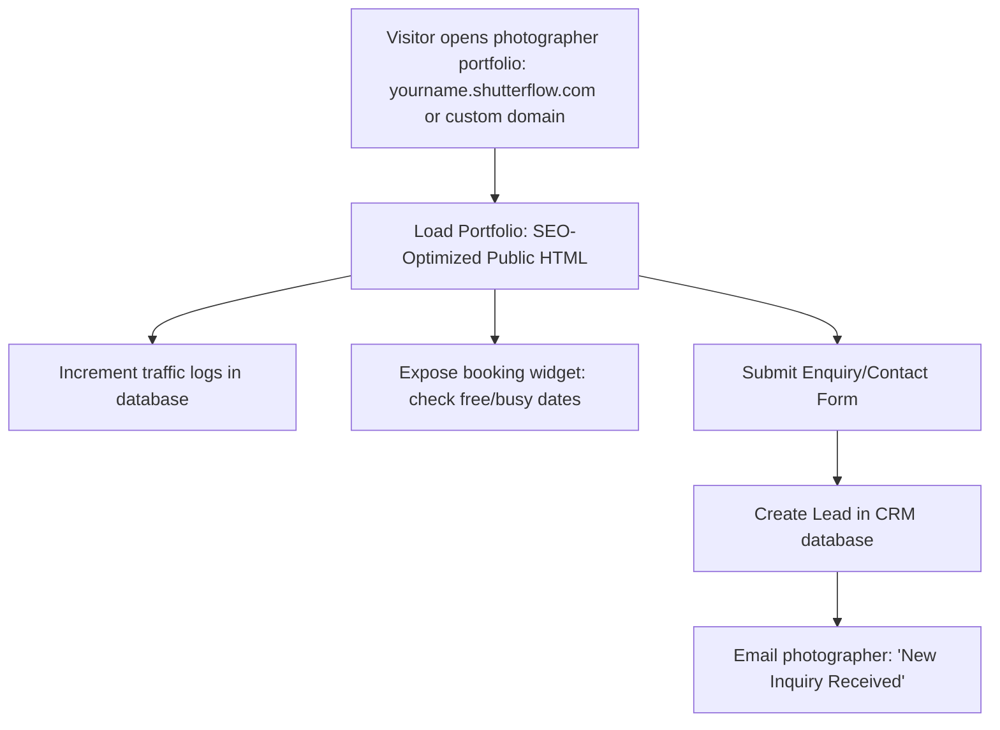

# ShutterFlow: Sprint 19 Plan — Public Portfolios & Marketing Assets

## 🎯 Sprint Goal
Construct a public website builder and public landing page framework. This system must generate public portfolios for photographers (displaying bio descriptions, portfolio pictures, pricing packages, and reviews), expose online booking widgets and availability checkers, automatically create CRM leads from contact forms, support custom domain mappings, add SEO meta tags, and compile page analytics (views, inquiries, conversions).

---

## 🛠️ Tech Stack & Services
- **Backend Architecture**: Spring Boot 3.3.5, Thymeleaf (rendering SEO-optimized pages).
- **Public Embedding**: Javascript widgets compiled to execute dynamically on external websites.
- **Relational Datastore**: MySQL 8.x tracing page traffic logs and enquiry forms.
- **Custom Domains Integration**: CNAME dns routing configurations.

---

## 📊 Public Portfolios & Leads Acquisition Flow

---

## 📅 Day-by-Day (Daily) Detailed Plan

### 📌 Day 1: Public Portfolio Controller
- **Goal**: Build SEO-optimized public portfolio controllers rendering bio descriptions, portfolios, packages, and reviews.
- **Technical Steps**:
  - Create the public portfolio controller `/public/portfolios/{username}`.
  - Return compiled profile details, S3 portfolio image lists, and approved reviews.
  - Optimize queries to handle high public traffic without performance issues.

### 📌 Day 2: Dynamic Contact Enquiry Forms
- **Goal**: Automatically create CRM leads in the database when contact forms are submitted.
- **Technical Steps**:
  - Create the public POST endpoint `/public/enquiries/submit` accepting contact forms.
  - Automatically instantiate a `Client` record in the CRM table, setting `leadSource = 'Website Portfolio'`.
  - Dispatch notification emails to photographers using SendGrid.

### 📌 Day 3: Embedded Booking Widgets
- **Goal**: Expose a customizable booking widget that photographers can embed on external sites.
- **Technical Steps**:
  - Create a public Javascript endpoint `/public/widgets/booking.js` that renders the scheduling widget on third-party sites.
  - Build public endpoints to load booking details, verify available slots, and handle submissions.

### 📌 Day 4: Public Portfolio Availability Verification
- **Goal**: Expose read-only availability checkers on public portfolios.
- **Technical Steps**:
  - Expose endpoints checking photographer calendar slots for the upcoming 60 days.
  - Mask personal information, showing only whether slots are free or busy.

### 📌 Day 5: SEO Meta Tags Compilation
- **Goal**: Dynamically add SEO meta tags to portfolio pages to optimize search engine indexing.
- **Technical Steps**:
  - Inject custom SEO meta tags (title, description, open graph tags) into public HTML templates.
  - Read SEO properties (e.g. "Specializing in wedding photography in Sydney") from the photographer's profile database entry.

### 📌 Day 6: Mapped Custom Subdomains & Domains
- **Goal**: Connect custom domains to ShutterFlow using DNS configurations.
- **Technical Steps**:
  - Build filter/routing systems resolving incoming host headers: e.g., mapping `SydneyLight.com` or `custom.subdomain` to the corresponding database studio record.

### 📌 Day 7: Public Page Traffic Logger
- **Goal**: Log anonymous page views, inquiries, and conversions.
- **Technical Steps**:
  - Implement `PageTrafficLog.java` tracking view logs, referrers, and timestamps.
  - Log events asynchronously using Spring `@Async` tasks to prevent page loads from slowing down.

### 📌 Day 8: Marketing Landing Pages
- **Goal**: Build the main ShutterFlow marketing website and pricing page.
- **Technical Steps**:
  - Create the root index controller rendering marketing features, testimonials, and clear pricing plans (`STARTER`, `PRO`, `STUDIO`).

### 📌 Day 9: Public Blog Engine
- **Goal**: Create a lightweight blog engine to support SEO content marketing.
- **Technical Steps**:
  - Implement `BlogPost.java` JPA entity.
  - Create CRUD endpoints to write blog posts and public controllers to display them.

### 📌 Day 10: E2E Website Builder Integration Tests
- **Goal**: Write tests verifying CRM lead generation, custom domain resolutions, and Sprint 19 DoD.
- **Technical Steps**:
  - Write MockMvc integration tests verifying:
    - Contact form submissions successfully create client cards in the database.
    - Host header filter rules map custom domains to the correct studio profiles.
    - Public endpoints exclude sensitive or unapproved feedback.

---

## 🧪 Sprint 19 Definition of Done (DoD)
- [ ] Portfolios load portfolio images, pricing packages, and reviews correctly.
- [ ] Contact forms create lead records in the CRM database automatically.
- [ ] Portfolio templates inject correct SEO meta tags dynamically.
- [ ] Custom domain filters map incoming requests to the correct studio entries.
- [ ] Analytics logs track visitor traffic and conversions asynchronously.
- [ ] All integration tests pass successfully (`./gradlew test`).

follow shutterflow_sprint_plan.html
