# ShutterFlow: Sprint 2 Plan — Multi-Tenant Auth & Magic Token Engine

## 🎯 Sprint Goal
Design and implement a highly secure, multi-tenant authentication system supporting JWT Access tokens (stored in-memory), Refresh tokens (stored in Redis Stack), Role-Based Access Control (RBAC) across all endpoints, dynamic Magic Link token logins for Clients (zero password), and robust brute-force security auditing.

---

## 🛠️ Tech Stack & Services
- **Backend Security**: Spring Security 6.x, JWT (HS512 signing).
- **In-Memory Store**: Redis Stack (tracking active session/refresh tokens).
- **Rate-Limiting Engine**: Bucket4j integrated with Spring Boot filters.
- **Crypto & Encoding**: BCrypt Password Encoder.
- **Transactional Mail**: SendGrid (dispatching magic links and password recovery URLs).

---

## 📊 Authentication Token Lifecycle Flow

```mermaid
sequenceDiagram
    participant User as Client / Photographer
    participant API as Spring Boot Security
    participant Redis as Redis Session Cache
    participant Mail as SendGrid API
    
    rect rgb(20, 24, 35)
        note right of User: Magic Token Access (Zero-Password Client Login)
        User->>API: Request Link (/auth/magic-request)
        API->>Redis: Generate & Store short-lived link token
        API->>Mail: Dispatch Link to User
        User->>API: Click Link (/auth/magic-login?token=XYZ)
        API->>Redis: Validate and invalidate token
        API-->>User: Return HTTP-Only Cookie (Refresh Token) & Memory JSON (Access Token)
    end
```

---

## 📅 Day-by-Day (Daily) Detailed Plan

### 📌 Day 1: Auth Database Schema Mapping & Entities
- **Goal**: Implement User entities, Roles, and database mappings.
- **Technical Steps**:
  - Update `User` table schemas. Define [UserRole.java](file:///c:/Users/amrit/shutterflow%20by%20ai/backend/src/main/java/com/shutterflow/core/user/UserRole.java) containing: `STUDIO_OWNER`, `PHOTOGRAPHER`, `SECOND_SHOOTER`, `CLIENT`, `ADMIN`.
  - Write [User.java](file:///c:/Users/amrit/shutterflow%20by%20ai/backend/src/main/java/com/shutterflow/core/user/User.java) JPA entity mapping columns to database constraints.
  - Implement [UserRepository.java](file:///c:/Users/amrit/shutterflow%20by%20ai/backend/src/main/java/com/shutterflow/core/user/UserRepository.java) incorporating lookup operations.

### 📌 Day 2: Spring Security & Cryptography Infrastructure
- **Goal**: Configure Spring Security filter chains and password hashers.
- **Technical Steps**:
  - Write `SecurityConfig` defining the core FilterChain. Disable CSRF (since we use JWT), set SessionCreationPolicy to `STATELESS`.
  - Configure `BCryptPasswordEncoder` bean (using strength 12 for robust hashing performance).
  - Open public endpoints (`/auth/register-studio`, `/auth/login`, `/auth/magic-login`) while securing all other controllers.

### 📌 Day 3: JWT Double-Token Architecture (HS512)
- **Goal**: Implement high-fidelity JWT creation and verification services.
- **Technical Steps**:
  - Write `JwtTokenProvider` using an HS512 secret key of at least 512 bits.
  - Encode claims: `sub` (User Email), `roles` (User Roles), and `studioId` (Tenant Scope).
  - Restrict Access Token lifetime to 15 minutes. Create helper validation routines parsing claims.

### 📌 Day 4: Redis-Backed Session & Refresh Token Management
- **Goal**: Configure HttpOnly session storage in Redis Stack to handle refresh tokens securely.
- **Technical Steps**:
  - Generate a secure 64-character UUID for Refresh Tokens. Store in Redis mapping to the User's email and session state, with a TTL of 7 days.
  - Serve Refresh Tokens in an HTTP-Only, Secure, SameSite=Strict cookie, making them inaccessible to JavaScript (eliminates XSS vectors).
  - Implement `/auth/refresh` parsing cookies, validating against Redis, and issuing new Access Tokens.

### 📌 Day 5: Dynamic Studio Onboarding Engine
- **Goal**: Build transaction-safe APIs managing the simultaneously created Studio and Owner User details.
- **Technical Steps**:
  - Build controller mapping to [RegisterStudioRequest.java](file:///c:/Users/amrit/shutterflow%20by%20ai/backend/src/main/java/com/shutterflow/core/user/dto/RegisterStudioRequest.java).
  - Annotate with `@Transactional` (Spring Core) so if the studio creation fails, the owner profile is rolled back, preventing orphaned database files.
  - Automatically instantiate default `StudioSettings` templates during studio initialization.

### 📌 Day 6: Secure Magic-Link Login Engine (Zero-Password Client Portals)
- **Goal**: Allow clients to sign in securely with a one-time link delivered to their email inbox.
- **Technical Steps**:
  - Write `/auth/magic-request` generating a cryptographically secure 128-character magic token.
  - Store token in Redis with a strict 15-minute expiration window.
  - Mail link (`/auth/magic-login?token=XYZ`) using SendGrid. On request, look up token in Redis, fetch associated Client details, and instantly issue JWT sessions.

### 📌 Day 7: Fully Encrypted Password Recovery Flow
- **Goal**: Implement standard secure password reset request handlers.
- **Technical Steps**:
  - Build `/auth/forgot-password` generating secure tokens dispatched to emails.
  - Create `/auth/reset-password` requiring token checks and parsing the new password safely.
  - Force validation preventing token re-use once password fields have updated.

### 📌 Day 8: Dynamic Method Security (RBAC Engine)
- **Goal**: Protect API REST resource paths dynamically depending on user identity privileges.
- **Technical Steps**:
  - Enable `@EnableMethodSecurity` in Spring Configuration settings.
  - Apply granular method protections: `@PreAuthorize("hasRole('STUDIO_OWNER')")` on configuration controllers.
  - Write custom Spring Expression Language (SpEL) validators matching requested `studioId` parameter keys against the authenticated caller token's `studioId` to enforce strict tenant isolation.

### 📌 Day 9: Security Audits & Bucket4j Rate Limiting
- **Goal**: Prevent brute-force attacks on login/registration gateways.
- **Technical Steps**:
  - Integrate **Bucket4j** inside a Spring Web Filter mapping authentication pathways.
  - Limit login requests to 5 attempts per minute per IP address. Block IPs exceeding limits for 30 minutes in Redis.
  - Log access violations in standard formats for security auditing.

### 📌 Day 10: Auth End-to-End Stress Testing
- **Goal**: Write tests verifying authentication overrides, permissions access, and rate-limiting blocks.
- **Technical Steps**:
  - Write MockMvc test suites simulating `STUDIO_OWNER` accessing client lists, and ensure `CLIENT` attempts to view admin settings are rejected with HTTP 403 Forbidden.
  - Mock S3 and SendGrid connectors. Complete Spring Boot verification runs.

---

## 🧪 Sprint 2 Definition of Done (DoD)
- [ ] JWT tokens generate claims correctly containing `email`, `role`, and `studioId`.
- [ ] Refresh tokens reside in Redis Stack with matching HTTP-Only cookie delivery.
- [ ] Access attempts from unauthorized roles result in HTTP 403 Forbidden.
- [ ] Magic links validate, issue active user sessions, and expire after one use.
- [ ] Rate limits trigger HTTP 429 Too Many Requests once thresholds are breached.
- [ ] All integration tests pass successfully (`./gradlew test`).
