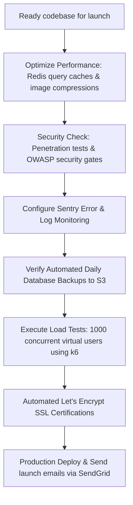

# ShutterFlow: Sprint 20 Plan — Polish, Performance & Production Launch

## 🎯 Sprint Goal
Complete final production launch preparations for ShutterFlow. This infrastructure phase focuses on mobile responsiveness audits, performance optimizations (API caching, image compression, lazy loading), Sentry error monitoring integration, penetration testing, database backup pipelines, automated SSL certificate generation (Let's Encrypt), load testing supporting 1,000 concurrent users, and the beta launch onboarding flow.

---

## 🛠️ Tech Stack & Services
- **Environment & Hosting**: Railway.app / AWS ECS (Docker configurations).
- **Error Tracking & Monitoring**: Sentry Java SDK integration.
- **Relational Datastore**: Production MySQL 8.x with automated daily S3 backups.
- **Security & Caching**: Redis Stack (API query caching) and Let's Encrypt SSL.
- **Load Testing**: Apache JMeter / k6 scripts.

---

## 📊 Infrastructure Launch & Security Gates

---

## 📅 Day-by-Day (Daily) Detailed Plan

### 📌 Day 1: Full Mobile Responsive Audit
- **Goal**: Perform mobile responsiveness audits across all pages and fix layout styling issues.
- **Technical Steps**:
  - Test the portal, dashboard, and public portfolios on diverse mobile screen resolutions.
  - Fix CSS styling bugs and adjust breakpoints to ensure layouts render correctly.

### 📌 Day 2: Redis-Backed API Query Caching
- **Goal**: Configure Redis caching for dashboard metrics, packages, and public reviews.
- **Technical Steps**:
  - Enable `@EnableCaching` in Spring configuration classes.
  - Apply `@Cacheable(value = "dashboard-stats", key = "#studioId")` annotations.
  - Implement cache eviction policies (`@CacheEvict`) that run when database records update.

### 📌 Day 3: Automated Image Compression
- **Goal**: Compress uploaded photos to optimize image delivery and speed up page loads.
- **Technical Steps**:
  - Configure image compression rules inside the S3 upload service.
  - Compress large photos into high-quality JPEG/WebP formats before saving to S3.

### 📌 Day 4: Sentry Error Monitoring Integration
- **Goal**: Integrate Sentry to track, capture, and alert developers of runtime exceptions.
- **Technical Steps**:
  - Add the Sentry Spring Boot starter dependency to the codebase.
  - Configure Sentry properties (DSN, environments) to report backend exceptions automatically.

### 📌 Day 5: Database Backup Pipelines to S3
- **Goal**: Build automated database backup schedulers exporting daily dumps to S3.
- **Technical Steps**:
  - Write standard bash/powershell backup scripts executing database dumps.
  - Schedule daily cron tasks running backups and saving archives to secure S3 directories.

### 📌 Day 6: OWASP Penetration Audits
- **Goal**: Conduct security audits to prevent SQL injection, cross-site scripting (XSS), and CSRF vulnerabilities.
- **Technical Steps**:
  - Audit database parameters, ensuring all queries use prepared statements.
  - Scan HTML outputs to ensure data inputs are sanitized, and verify cookies are configured with HttpOnly and SameSite=Strict headers.

### 📌 Day 7: Load Testing via k6
- **Goal**: Perform load testing simulating 1,000 concurrent virtual users.
- **Technical Steps**:
  - Write k6 load testing scripts targeting public portfolios, dashboards, and booking wizards.
  - Run tests, monitor performance, and optimize slow-running SQL queries or database indexes.

### 📌 Day 8: SSL Certifications (Let's Encrypt)
- **Goal**: Configure Let's Encrypt SSL certificates for custom domains.
- **Technical Steps**:
  - Integrate reverse proxy routing (e.g. Nginx or Traefik) and automate SSL certificate renewals.

### 📌 Day 9: Guided Onboarding Flows
- **Goal**: Design guided tour modals to help new photographers configure their studios.
- **Technical Steps**:
  - Map user metadata fields tracking if photographers have completed onboarding checklist steps.
  - Build endpoints showing or hiding onboarding flows based on user profile progress.

### 📌 Day 10: E2E Launch Verification Tests
- **Goal**: Run final compilation audits, execute all unit/integration tests, and complete Sprint 20 DoD.
- **Technical Steps**:
  - Execute clean builds, running `./gradlew build` to ensure all tests pass.
  - Verify that Sentry, database backups, and Redis caching services configure and start cleanly.

---

## 🧪 Sprint 20 Definition of Done (DoD)
- [ ] Dashboards, portfolios, and portals pass responsive design audits.
- [ ] Redis caching reduces page load times for dashboard statistics.
- [ ] Sentry captures and reports runtime exceptions to developers.
- [ ] Daily database backups dump data and upload archives to S3.
- [ ] Codebase passes OWASP security reviews, preventing injection attacks.
- [ ] All integration tests pass successfully (`./gradlew test`).

follow shutterflow_sprint_plan.html
