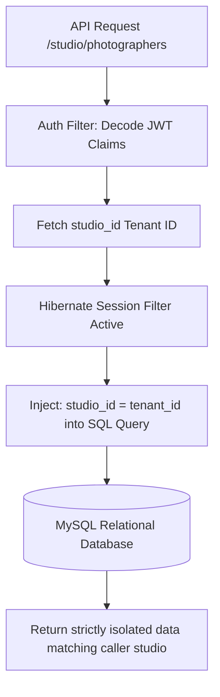

# ShutterFlow: Sprint 3 Plan — Studio Management & Team Allocation

## 🎯 Sprint Goal
Build out complete multi-tenant boundaries for photographic studios, configuring subscription plan thresholds (`STARTER`, `PRO`, `STUDIO`), designing team invitation engines, allowing photographer profile portfolios, establishing studio currency/BAS tax settings (GST 10% for Australia), and defining custom revenue split matrices.

---

## 🛠️ Tech Stack & Services
- **Backend Architecture**: Spring Boot 3.3.5 (multi-tenant filtering, Spring AOP/Interceptors).
- **Database Engine**: Hibernate 6.x Filters + MySQL 8.x.
- **Transactional Mail**: SendGrid (dispatching studio team join requests).
- **Blob Storage**: AWS S3 (hosting photographer portfolio items, logos, branding assets).

---

## 📊 Multi-Tenant Isolation & Hibernate Filters

---

## 📅 Day-by-Day (Daily) Detailed Plan

### 📌 Day 1: Studio Model Expansion & Dynamic Branding
- **Goal**: Add visual identity fields to the Studio entity and create customization APIs.
- **Technical Steps**:
  - Extend [Studio.java](file:///c:/Users/amrit/shutterflow%20by%20ai/backend/src/main/java/com/shutterflow/core/studio/Studio.java) with support for logo image S3 keys, primary/secondary colors, and custom fonts.
  - Implement `/studio/branding` PATCH endpoints allowing studio owners to adjust interface visual attributes.
  - Connect upload routines to AWS S3, uploading studio logos under folder scope `/studios/{studioId}/logo/`.

### 📌 Day 2: Subscription Tier Rules Engine
- **Goal**: Implement enforcements limiting features depending on the studio's active plan.
- **Technical Steps**:
  - Map `PlanTier` quotas:
    - `STARTER`: 1 Photographer, 5 active bookings/month.
    - `PRO`: 3 Photographers, 30 active bookings/month.
    - `STUDIO`: Unlimited Photographers, unlimited bookings.
  - Write Spring AOP Aspects (`@Before` annotations) or custom Interceptors intercepting invite operations and verifying quota compliance before dispatch.

### 📌 Day 3: Studio Settings API & Australian Compliance
- **Goal**: Build configuration systems for currencies, tax rates (10% GST default), and studio bank details.
- **Technical Steps**:
  - Implement settings endpoints `/studio/settings`. Store configuration records in the `studio_settings` table.
  - Validate parameters ensuring GST percentages (e.g. `10.00`) are correctly saved, and that currency choices are strictly restricted to valid codes (AUD, USD, EUR, GBP, NPR).

### 📌 Day 4: Hibernate Multi-Tenant Data Filters
- **Goal**: Eliminate cross-tenant data leaks using automated database filters.
- **Technical Steps**:
  - Declare a `@FilterDef` on all tenant-scoped JPA entities (`User`, `Client`, `Package`, `Booking`, etc.).
  - Set default filtering condition: `studio_id = :studioId`.
  - Write a Spring Controller Interceptor extracting `studioId` from the active JWT context and enabling the Hibernate `@Filter` with the caller's tenant ID on every session.

### 📌 Day 5: Secure Team Invitation Engine
- **Goal**: Build automated invitation systems targeting new staff members.
- **Technical Steps**:
  - Create `/studio/invite` generating invitation records containing secure UUID tokens, valid for 48 hours.
  - Mail join links (`/studio/join?token=XYZ`) using SendGrid.
  - Define custom DTO mappings to prevent photographer invite parameters from exposing private studio subscription attributes.

### 📌 Day 6: Join Request Handlers & Token Redemptions
- **Goal**: Validate accepted join tokens and link users to the inviting studio.
- **Technical Steps**:
  - Build public endpoint `/studio/accept-invite` taking the target token.
  - On submission: verify token validity, fetch inviting studio metadata, create/update User profile, assign `PHOTOGRAPHER` role, and link `studio_id`. Mark token as redeemed.

### 📌 Day 7: Photographer Portfolios & Availability Settings
- **Goal**: Allow staff members to manage their portfolio pictures, descriptions, and operational calendars.
- **Technical Steps**:
  - Create `PhotographerProfile` mapping to the database. Include fields for bio text, specializations, availability times (JSON formatted, e.g. Mon-Fri 09:00-17:00).
  - Enable multiple portfolio photo uploads, storing keys in S3 folders `/studios/{studioId}/photographers/{userId}/`.

### 📌 Day 8: Consolidated Team Dashboard APIs
- **Goal**: Build administration listings compiling studio staff details and metrics.
- **Technical Steps**:
  - Write high-performance JPQL queries fetching team records alongside active shoot counts.
  - Allow studio owners to dynamically adjust photographer status (Active, On-Leave, Inactive) or revoke access privileges entirely.

### 📌 Day 9: Commission Matrices & Revenue Splits
- **Goal**: Design configurations defining payout distributions between studio spaces and photographers.
- **Technical Steps**:
  - Implement commission configuration endpoints. Store rules: base splits (e.g. 70% to Studio, 30% to Photographer) or flat fees per shoot type.
  - Model configurations to allow seamless runtime lookups during invoicing.

### 📌 Day 10: Limit Verification & Integration Audits
- **Goal**: Write tests verifying subscription limit enforcements and multi-tenant isolation.
- **Technical Steps**:
  - Write test cases verifying:
    - A `STARTER` studio attempting to invite a second photographer receives a `403 Forbidden` plan limit exception.
    - SQL statements injected by Hibernate filters strictly append `studio_id` clauses to all database executions.

---

## 🧪 Sprint 3 Definition of Done (DoD)
- [ ] Studios customize branding parameters with images securely hosted in AWS S3.
- [ ] Interceptors reject photographer invitations if plan quotas are exceeded.
- [ ] Active Hibernate filters append tenancy clauses to all SQL queries automatically.
- [ ] Invitation tokens expire after 48 hours and reject multi-use attempts.
- [ ] Portfolios store bios and availabilities correctly in database schemas.
- [ ] All integration tests pass successfully (`./gradlew test`).
