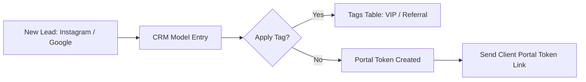

# ShutterFlow: Sprint 4 Plan — Client CRM & Lead Pipeline

## 🎯 Sprint Goal
Construct a robust, multi-tenant CRM pipeline capable of handling individual clients, managing wedding/portrait partner details, structuring customized client tag systems (`VIP`, `Corporate`), tracing client referral lead sources, generating secure portal token keys, and importing thousands of contacts in seconds using an optimized multi-threaded CSV bulk ingestion loader.

---

## 🛠️ Tech Stack & Services
- **Backend Framework**: Spring Boot 3.3.5, Spring Data JPA.
- **Database Engine**: MySQL 8.x with custom indices.
- **Filtering System**: JPA Specifications API (dynamic composite queries).
- **Bulk Processing**: Apache Commons CSV or standard regex-based parser (multi-threaded ingestion).
- **Security Provision**: Dynamic Cryptographic UUID Generator.

---

## 📊 CRM Lead & Ingestion Lifecycle

---

## 📅 Day-by-Day (Daily) Detailed Plan

### 📌 Day 1: CRM Core Schema & Multi-Tenant Isolated Entities
- **Goal**: Model CRM records and isolate database access.
- **Technical Steps**:
  - Implement [Client.java](file:///c:/Users/amrit/shutterflow%20by%20ai/backend/src/main/java/com/shutterflow/core/client/Client.java) JPA entity linking to the database `clients` table.
  - Link the client to a parent `Studio` using multi-tenant boundaries.
  - Implement [ClientRepository.java](file:///c:/Users/amrit/shutterflow%20by%20ai/backend/src/main/java/com/shutterflow/core/client/ClientRepository.java) defining baseline queries.

### 📌 Day 2: CRM REST Controllers & Input Sanitizations
- **Goal**: Write standard REST CRUD pathways.
- **Technical Steps**:
  - Create `ClientController` supporting POST/GET/PUT/DELETE.
  - Implement strict request-body validation (e.g. email formats, phone length checks).
  - Enforce validations preventing duplicate active client emails within the same studio workspace.

### 📌 Day 3: Wedding Partner & Auxiliary Contacts Mapping
- **Goal**: Link secondary contact details (e.g., partners for weddings) to primary CRM cards.
- **Technical Steps**:
  - Create [ClientContact.java](file:///c:/Users/amrit/shutterflow%20by%20ai/backend/src/main/java/com/shutterflow/core/client/ClientContact.java) ManyToOne mapping.
  - Build endpoints enabling users to link contacts (e.g. name, email, phone, relation like 'Bride', 'Groom', 'Parent') dynamically.
  - Enable cascade deletes so deleting a client removes all linked contacts.

### 📌 Day 4: Dynamic Tagging & Audience Segmentation
- **Goal**: Implement client classifications.
- **Technical Steps**:
  - Write tag management mechanisms. Track tags (`VIP`, `Corporate`, `Referral`) per Client in the database.
  - Provide quick lookup routes searching tags dynamically.

### 📌 Day 5: Lead Source Analytics
- **Goal**: Measure client referral pathways to calculate marketing channel ROI.
- **Technical Steps**:
  - Define lead sources: `Instagram`, `Google Search`, `Referral`, `Wedding Fair`, `Facebook`.
  - Compile simple aggregation endpoints `/crm/leads/roi` summarizing the total value generated by each lead channel.

### 📌 Day 6: Secure Portal Access & Token Provisioning
- **Goal**: Generate client access keys allowing secure, password-less entry to individual portals.
- **Technical Steps**:
  - Implement token generator generating secure UUID keys. Store tokens in the client record.
  - Provision unique portal links: `https://client.shutterflow.com/portal?token=UUID`.
  - Allow studio owners to revoke or regenerate keys instantly to protect client security.

### 📌 Day 7: Multi-Threaded CSV Ingestion Engine
- **Goal**: Import thousand-row spreadsheets into database tables in seconds.
- **Technical Steps**:
  - Build `/crm/import` taking multipart file uploads.
  - Implement a fast CSV parser parsing rows asynchronously.
  - Validate and import columns (First Name, Last Name, Email, Phone, Tags) and ignore rows containing corrupted formats, compiling errors into a detailed JSON validation report.

### 📌 Day 8: High-Performance Search via JPA Specifications
- **Goal**: Build dynamic filters combining search parameters seamlessly.
- **Technical Steps**:
  - Implement `JpaSpecificationExecutor` on `ClientRepository`.
  - Create `ClientSpecification` containing helpers mapping runtime search parameters (first name wildcard search, matching tags, minimum spends, created date ranges).

### 📌 Day 9: Automatic Lifetime Spend Aggregators
- **Goal**: Track lifetime client spends automatically upon payment confirmations.
- **Technical Steps**:
  - Write an Application Event Listener listening for invoice completions.
  - When payment events fire, recalculate and update the client's `totalSpend` transactionally.

### 📌 Day 10: Ingestion Load Testing & Integration Audits
- **Goal**: Perform import stress tests, database checks, and finish Sprint 4 DoD.
- **Technical Steps**:
  - Run integration tests validating CRM multi-tenant boundaries. Ensure a studio caller cannot fetch CRM details from other studio tenants.
  - Execute imports with a 1000-row sample sheet. Verify execution completes in under 2 seconds.

---

## 🧪 Sprint 4 Definition of Done (DoD)
- [ ] CRM controllers validate input parameters and isolate data by studio.
- [ ] Secondary contacts link transactionally and support cascade deletion.
- [ ] Portal tokens generate secure UUID keys and permit link-based authentication.
- [ ] CSV bulk importer parses uploads in parallel, rejecting bad rows gracefully.
- [ ] JPA Specifications compile dynamic SQL search structures successfully.
- [ ] All integration tests pass successfully (`./gradlew test`).
