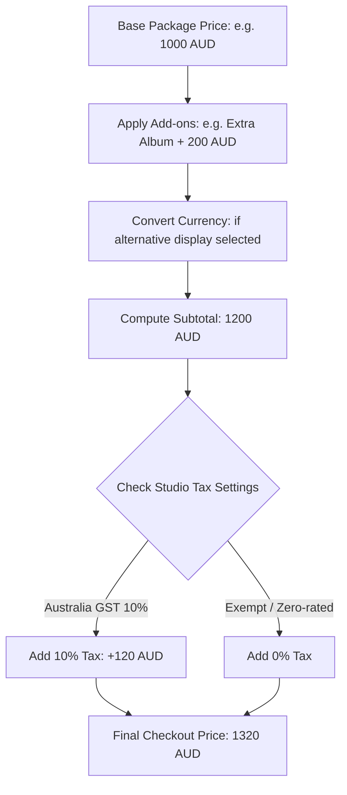

# ShutterFlow: Sprint 5 Plan — Packages & Pricing

## 🎯 Sprint Goal
Establish a comprehensive photography packages and pricing management engine enabling studios and individual photographers to build customizable shoot packages. This includes support for base rates, structured add-ons (extra hours, prints, albums, USB drives), base tax compliance rates (such as Australia's 10% GST), multi-currency handling (AUD, USD, EUR, GBP, NPR), package duplication workflows, seasonal pricing rules, and dynamic price list PDF generation.

---

## 🛠️ Tech Stack & Services
- **Backend Framework**: Spring Boot 3.3.5, Spring Data JPA.
- **Tax & Currency Support**: Custom Java Money API abstractions (JSR-354 or BigDecimal).
- **Document Generation**: OpenPDF / iText or Thymeleaf-to-PDF templates.
- **Relational Datastore**: MySQL 8.x with custom pricing indices.

---

## 📊 Package Pricing & Tax Calculation Flow

---

## 📅 Day-by-Day (Daily) Detailed Plan

### 📌 Day 1: Photography Package Core Schema
- **Goal**: Model packages table structure and implement the base entities.
- **Technical Steps**:
  - Implement `Package.java` JPA entity.
  - Link packages to `Studio` using the multi-tenant `@Filter` boundaries.
  - Include fields for package name, description, base price, duration (hours), deliverables (e.g. number of photos), and visibility.
  - Create the `packages` database table using dynamic schema update or record validation.

### 📌 Day 2: Package Add-ons & Mappings
- **Goal**: Create structural models representing optional items clients can add during booking.
- **Technical Steps**:
  - Implement `PackageAddon.java` entity as a `@ManyToOne` or `@ElementCollection` mapping.
  - Structure options: e.g., "Extra Hour" ($150/hr), "Wedding Album" ($400), "USB Drive" ($50).
  - Map cascading deletes so removing a package purges its related add-ons.

### 📌 Day 3: Visibility Scopes & Selection Rules
- **Goal**: Implement packages access scopes (Public vs Private) and custom options.
- **Technical Steps**:
  - Implement a dynamic flag `isPublic` on packages.
  - Configure filter rules: public packages are exposed to client inquiry forms and booking widgets, while private packages are reserved for studio-direct bookings.
  - Write validation mechanisms ensuring active package boundaries per photographer.

### 📌 Day 4: Multi-Currency Pricing Architecture
- **Goal**: Add multi-currency storage capabilities to support diverse international studios.
- **Technical Steps**:
  - Track base currency code per package (AUD, USD, EUR, GBP, NPR) using custom currency validations.
  - Map currency conversion matrices or configuration routes for package display.

### 📌 Day 5: Multi-Tenant Tax Configurations & Australian Compliance
- **Goal**: Calculate and apply tax rates (e.g., Australia's 10% GST) during pricing operations.
- **Technical Steps**:
  - Look up default tax rates in the `StudioSettings` table.
  - Implement a pricing engine utility computing gross, tax amount, and net values dynamically.
  - Formulate validation rules preventing invalid tax percentages (e.g., negative tax values).

### 📌 Day 6: One-Click Package Duplication
- **Goal**: Enable studios to copy existing packages instantly to minimize manual admin overhead.
- **Technical Steps**:
  - Build `/packages/{id}/duplicate` endpoint.
  - Perform deep duplication: copy name with a suffix (e.g. " (Copy)"), base price, deliverables, and all linked add-on items.
  - Save as a new transaction-safe package under the same studio owner.

### 📌 Day 7: Seasonal Pricing Overrides
- **Goal**: Build custom rules enabling packages to adjust their rates dynamically depending on the selected date.
- **Technical Steps**:
  - Create a `SeasonalPriceRule` mapping start dates, end dates, and price adjustments (fixed discount/markup or percentage).
  - Inject price adjustments during booking inquiries within the seasonal window.

### 📌 Day 8: Dynamic Price List PDF Generator
- **Goal**: Compile professional, beautifully formatted price lists that photographers can download or email.
- **Technical Steps**:
  - Create an endpoint `/packages/pdf` retrieving all public packages for a studio.
  - Render an HTML template compiled with studio branding (logo, primary colors) and convert it into a standard PDF stream.

### 📌 Day 9: Package REST Controller & Input Sanitization
- **Goal**: Implement CRUD REST endpoints secured with tenancy checks.
- **Technical Steps**:
  - Create `PackageController` with `@PreAuthorize` methods validating studio access.
  - Check request bodies for negative pricing inputs, empty titles, or non-matching currencies.

### 📌 Day 10: Package Pricing Integration Test Suite
- **Goal**: Write tests verifying accurate pricing math, multi-tenant isolation, and complete Sprint 5 DoD.
- **Technical Steps**:
  - Write mock MVC integration tests:
    - Test package duplication replicates child add-on arrays accurately.
    - Test pricing engines evaluate Australian GST (10%) and base costs flawlessly.
    - Test access controls to prevent tenant crosstalk.

---

## 🧪 Sprint 5 Definition of Done (DoD)
- [ ] Base packages and add-ons link transactionally with cascading deletes.
- [ ] Pricing calculations compute correct tax offsets (including Australia's 10% GST).
- [ ] Currencies restrict entries to valid international formats (AUD, USD, etc.).
- [ ] PDF generator compiles clean, branded price guides.
- [ ] All integration tests pass successfully (`./gradlew test`).

follow shutterflow_sprint_plan.html
