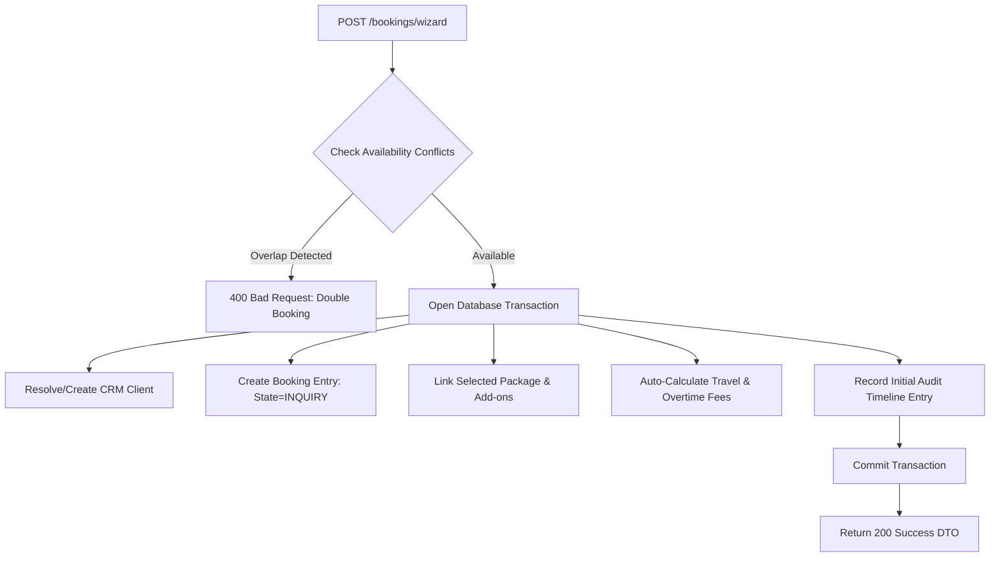

# ShutterFlow: Sprint 6 Plan — Booking System & Event Lifecycle

## 🎯 Sprint Goal
Construct a robust, transaction-safe booking wizard and event scheduling database capable of handling complex event pipelines. The system must manage booking lifecycle transitions (`INQUIRY` → `QUOTED` → `CONTRACT_SENT` → `BOOKED` → `COMPLETED` → `ARCHIVED`), prevent overlapping availability schedules, allocate primary and secondary photographers, link custom pricing packages, auto-calculate travel/overtime fees, and keep detailed audit logs for every state transition.

---

## 🛠️ Tech Stack & Services
- **Backend Architecture**: Spring Boot 3.3.5, Spring Data JPA.
- **Relational Datastore**: MySQL 8.x with indexes on booking times.
- **Audit Logs**: Spring Data JPA Entity Listeners or Hibernate Envers.
- **Transactional Support**: Spring Core `@Transactional` boundaries.

---

## 📊 Booking Creation Wizard Transaction Flow

---

## 📅 Day-by-Day (Daily) Detailed Plan

### 📌 Day 1: Booking Entity & Database Mapping
- **Goal**: Model the relational core of the booking module with status enum support.
- **Technical Steps**:
  - Implement `Booking.java` entity containing status enum: `INQUIRY`, `QUOTED`, `CONTRACT_SENT`, `BOOKED`, `COMPLETED`, `ARCHIVED`.
  - Include event date, start/end times, venue address, and multi-tenant `studioId` fields.
  - Link bookings to the primary `Client` entity as a `@ManyToOne` association.

### 📌 Day 2: Booking Wizard Transaction Endpoint
- **Goal**: Build a single-call endpoint facilitating creation of clients, bookings, and package selections simultaneously.
- **Technical Steps**:
  - Create `/bookings/wizard` POST endpoint processing a unified request payload.
  - Enforce `@Transactional` boundary. If any element (e.g. client registration or package verification) fails, rollback the entire transaction.

### 📌 Day 3: Package Linkages & Pricing Snapshot
- **Goal**: Associate photography packages with bookings, caching prices to protect against future modifications.
- **Technical Steps**:
  - Link packages to bookings through `@ManyToOne` bindings.
  - Store a static pricing snapshot (base price, add-ons sum, tax applied) in the booking record to guarantee that updating package templates later does not corrupt past billing records.

### 📌 Day 4: Second Shooter Assignment Matrix
- **Goal**: Implement primary and secondary shooter allocations per event, validating roles.
- **Technical Steps**:
  - Map photographer associations in the booking table: `primaryPhotographerId` and `secondShooterId` pointing to the user table.
  - Restrict second shooter assignments strictly to users holding the `SECOND_SHOOTER` or `PHOTOGRAPHER` roles.

### 📌 Day 5: Internal vs Client-Visible Booking Notes
- **Goal**: Provide isolated communication text fields preventing internal operational notes from exposing to clients.
- **Technical Steps**:
  - Map separate fields in `Booking`: `clientNotes` (shared in portals) and `internalNotes` (visible exclusively to team members).
  - Enforce read sanitization in DTO mapping layers based on caller roles.

### 📌 Day 6: Travel & Overtime Fee Auto-Calculations
- **Goal**: Automate financial overrides mapping travel expenses and session extensions.
- **Technical Steps**:
  - Map settings: base travel threshold (e.g., $1.50 per km beyond 50km radius) and hourly overtime rates (e.g., $150/hr).
  - Calculate travel overhead using coordinates or mapped distances and inject computed fees into the booking total.

### 📌 Day 7: Schedule Double-Booking Availability Filters
- **Goal**: Prevent booking overlapping timeframes for the same photographer.
- **Technical Steps**:
  - Implement dynamic lookup queries checking for existing `BOOKED` events overlapping requested start/end ranges.
  - Reject requests with a `400 Bad Request` validation error if scheduling conflicts occur.

### 📌 Day 8: Booking Deletion & Duplication Systems
- **Goal**: Build fast recurrence mechanisms copying events for loyal clients.
- **Technical Steps**:
  - Build booking duplicate routes `/bookings/{id}/duplicate` copying dates, addresses, and packages.
  - Ensure duplicate bookings start clean in the `INQUIRY` state and verify availability.

### 📌 Day 9: State Machine Audits & Booking Timelines
- **Goal**: Track historical status logs capturing details on who changed event statuses and when.
- **Technical Steps**:
  - Create a `BookingAuditLog` or `BookingTimeline` entity mapping booking state changes, timestamps, and the executing user ID.
  - Utilize Hibernate lifecycle annotations (`@PostUpdate`) to record transitions automatically.

### 📌 Day 10: E2E Booking Integration Tests
- **Goal**: Write tests verifying the state machine, scheduling safety, and Sprint 6 DoD compliance.
- **Technical Steps**:
  - Write MockMvc integration tests verifying:
    - Double bookings fail with conflicts.
    - Status transitions write timeline audit history records.
    - Transactional rollback executes correctly upon faulty wizard inputs.

---

## 🧪 Sprint 6 Definition of Done (DoD)
- [ ] Unified booking wizard handles clients, events, and packages transactionally.
- [ ] Overlapping booking requests are rejected with explicit conflict errors.
- [ ] Multi-photographer role restrictions are strictly checked on assignment.
- [ ] Financial modules auto-calculate travel/overtime surcharges.
- [ ] Audit logs track booking status transitions in a persistent timeline table.
- [ ] All integration tests pass successfully (`./gradlew test`).

follow shutterflow_sprint_plan.html
