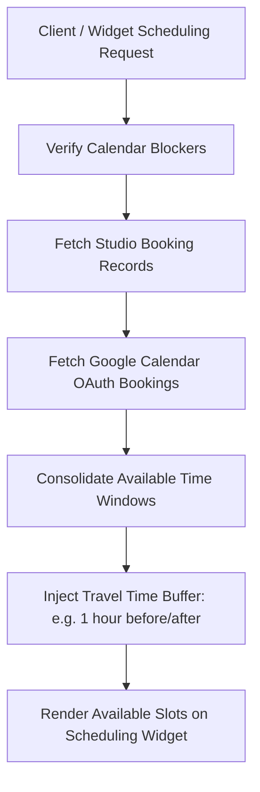

# ShutterFlow: Sprint 7 Plan — Calendar & Scheduling Engine

## 🎯 Sprint Goal
Construct an enterprise-grade calendar aggregation and scheduling widget. This engine must consolidate booking schedules, personal time-offs, and custom availability blocks, support 2-way Google Calendar synchronization via secure OAuth2 pathways, provide multi-photographer studio calendar views, expose read-only public availability endpoints for customer-facing scheduling widgets, respect travel buffer zones, and export scheduling records into standard iCal configurations.

---

## 🛠️ Tech Stack & Services
- **Backend Architecture**: Spring Boot 3.3.5, OAuth2 client integration.
- **External Integration**: Google Calendar API REST endpoints.
- **Scheduling Calculations**: Java Time API (ZonedDateTime validation).
- **Export standard**: RFC 5545 iCalendar specification generator.
- **Frontend library**: Angular 17+ with FullCalendar integrations.

---

## 📊 Calendar Aggregation & Scheduling Flow

---

## 📅 Day-by-Day (Daily) Detailed Plan

### 📌 Day 1: Calendar Event Schema & Multi-Type Models
- **Goal**: Model different calendar entries to support varied time allocations.
- **Technical Steps**:
  - Implement `CalendarEvent.java` entity.
  - Support event type enums: `BOOKING` (linked to booking), `BLOCK` (admin-blocked), `PERSONAL` (personal time-off).
  - Map multi-tenant indices ensuring calendar lookups stay highly isolated by studio.

### 📌 Day 2: Dynamic Calendar Range Lookups
- **Goal**: Build high-performance monthly, weekly, and daily grid retrieval endpoints.
- **Technical Steps**:
  - Implement endpoints `/calendar` accepting query parameters for start and end timezones.
  - Write optimized JPQL/Specification filters returning consolidated event logs within given ranges.

### 📌 Day 3: Availability Blocking APIs
- **Goal**: Enable photographers to mark custom unavailable dates and recurring holiday windows.
- **Technical Steps**:
  - Create REST APIs POST/DELETE `/calendar/blocks`.
  - Validate blocking logic, preventing photographers from blocking times that already contain confirmed active bookings.

### 📌 Day 4: Google Calendar OAuth Integration (Part 1)
- **Goal**: Establish the OAuth2 consent flow to connect photographers' Google accounts.
- **Technical Steps**:
  - Configure Google OAuth client registrations.
  - Implement callback endpoints securing refresh and access tokens in a user credentials database.

### 📌 Day 5: 2-Way Google Calendar Sync Engine (Part 2)
- **Goal**: Synchronize calendar slots dynamically, pulling external appointments and pushing ShutterFlow events.
- **Technical Steps**:
  - Build background sync workers pulling updates from the Google Calendar API.
  - Handle webhook notifications indicating external modifications, updating the internal cache.

### 📌 Day 6: Multi-Photographer Studio Aggregator
- **Goal**: Build unified team dashboards showing availability overlays across all photographers.
- **Technical Steps**:
  - Create administration calendar routes compiling schedules for all associated photographers in one workspace.
  - Color-code schedules by staff assignment to help studio owners dispatch resources.

### 📌 Day 7: Public Scheduling API & Widgets
- **Goal**: Expose a read-only availability path that can be safely accessed without user credentials.
- **Technical Steps**:
  - Create secure, public endpoints `/public/studios/{studioSlug}/availability` showing free/busy schedules.
  - Exclude all personal info or client names from public payloads, exposing only generic "Busy" intervals.

### 📌 Day 8: Travel Buffer & Conflict Detection
- **Goal**: Enforce travel time thresholds to prevent booking locations too close together.
- **Technical Steps**:
  - Write logical helper algorithms checking travel buffer settings (e.g. 60-minute windows).
  - Prevent booking creations if the interval between events in different venues is shorter than the required buffer.

### 📌 Day 9: Standard iCalendar (.ics) Exporter
- **Goal**: Generate RFC-compliant iCal feeds so photographers can subscribe via Apple/Outlook calendars.
- **Technical Steps**:
  - Create dynamic `.ics` file generator routes at `/calendar/export/{token}`.
  - Structure valid iCal blocks (VEVENT, SUMMARY, DTSTART, DTEND) adhering strictly to RFC 5545 rules.

### 📌 Day 10: Scheduling and Calendar Integration Tests
- **Goal**: Write tests verifying buffer calculations, public read scopes, and Sprint 7 DoD.
- **Technical Steps**:
  - Write MockMvc integration tests:
    - Public availability excludes client details.
    - Double bookings with overlapping travel buffers are blocked.
    - iCal exports generate correctly structured `.ics` files.

---

## 🧪 Sprint 7 Definition of Done (DoD)
- [ ] Calendar supports distinct entry types (BOOKING, BLOCK, PERSONAL).
- [ ] Google Calendar OAuth sync connects and processes bidirectional schedules.
- [ ] Public availability APIs protect confidential data, showing only free/busy slots.
- [ ] Travel buffer restrictions block overlapping, geographically separated events.
- [ ] Calendar exporter serves valid RFC-compliant `.ics` files.
- [ ] All integration tests pass successfully (`./gradlew test`).

follow shutterflow_sprint_plan.html
