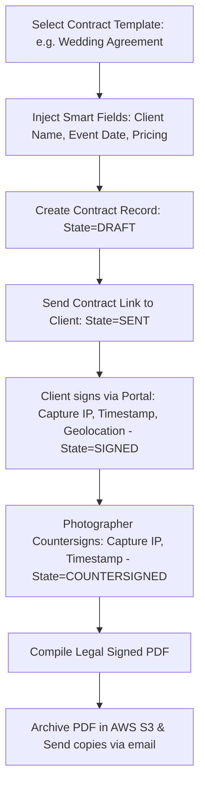

# ShutterFlow: Sprint 8 Plan — Contracts & E-Signature Engine

## 🎯 Sprint Goal
Construct a robust, legally-compliant digital contract creation and e-signature framework (compliant with the Australian Electronic Transactions Act 1999). This framework must enable studios to manage reusable contract templates, dynamically resolve "smart fields" (auto-populating client info, event dates, locations, and pricing amounts), support multi-party e-signatures (client signature and photographer countersignature) along with complete audit details (timestamps, IP addresses, geolocations), generate legal PDF copies of signed agreements, and support detailed status tracking.

---

## 🛠️ Tech Stack & Services
- **Backend Framework**: Spring Boot 3.3.5, Thymeleaf (generating legal HTML text layouts).
- **E-Signature Capture**: SVG / Base64 Canvas-based coordinates collection.
- **PDF Generation**: OpenPDF or Flying Saucer with S3 archival persistence.
- **Database Engine**: MySQL 8.x storing signee audit properties.

---

## 📊 Contract Creation & E-Signature Lifecycle

---

## 📅 Day-by-Day (Daily) Detailed Plan

### 📌 Day 1: Contract Template Schema
- **Goal**: Model contract templates and database collections for reusable agreements.
- **Technical Steps**:
  - Implement `ContractTemplate.java` JPA entity.
  - Link templates to `Studio` structures.
  - Include fields for template name, body text (supporting token placeholders like `{{client_name}}`, `{{event_date}}`), and event type.

### 📌 Day 2: Mapped Contract Entities
- **Goal**: Model active contract instances linked to specific customer bookings.
- **Technical Steps**:
  - Implement `Contract.java` entity containing status enum: `DRAFT`, `SENT`, `SIGNED`, `COUNTERSIGNED`.
  - Link contracts directly to both `Booking` and `Client` entities.

### 📌 Day 3: Smart Fields Resolution Engine
- **Goal**: Parse placeholders inside contract text templates and dynamically replace them with booking details.
- **Technical Steps**:
  - Write a token parser scanning text for placeholders: `{{client_name}}`, `{{event_date}}`, `{{event_location}}`, `{{booking_amount}}`.
  - Resolve placeholders against the active DB booking records and compile a clean HTML output.

### 📌 Day 4: Send Contract Dispatcher
- **Goal**: Build routes to dispatch contract review links to clients.
- **Technical Steps**:
  - Create endpoints enabling the status transition `DRAFT` → `SENT`.
  - Auto-generate an access token link and dispatch review alerts through SendGrid.

### 📌 Day 5: Client Signature Capture Portal API
- **Goal**: Create client-facing endpoints to record digital signature inputs securely.
- **Technical Steps**:
  - Build public endpoints capturing signature inputs (stored as Base64 SVG/PNG vectors).
  - Capture critical legal audit headers: caller's IP address, User-Agent, and geolocation details.
  - Advance contract state to `SIGNED`.

### 📌 Day 6: Photographer Countersignature Matrix
- **Goal**: Enable photographers to countersign signed client agreements.
- **Technical Steps**:
  - Build endpoints `/contracts/{id}/countersign` secured with photographer privileges.
  - Record the photographer's signature details and set the final state to `COUNTERSIGNED`.

### 📌 Day 7: Certified PDF Compiler
- **Goal**: Generate beautifully formatted, unmodifiable PDF records of completed agreements.
- **Technical Steps**:
  - Render a certified HTML page incorporating the contract text, both signature graphics, and the detailed audit logs.
  - Compile the page into a secure PDF, adding metadata protections to prevent tampering.

### 📌 Day 8: Automated AWS S3 Archival
- **Goal**: Persist completed PDF files in S3 buckets for permanent storage.
- **Technical Steps**:
  - Integrate PDF upload triggers with AWS S3, placing files in secure folders: `/studios/{studioId}/contracts/`.
  - Dispatch copies of the completed PDF to both the client and studio email addresses via SendGrid.

### 📌 Day 9: Model Release Forms
- **Goal**: Model and manage standard photography model release agreements.
- **Technical Steps**:
  - Support model release agreements as distinct document schemas.
  - Implement similar e-signature tracking mechanisms on model release templates.

### 📌 Day 10: Legal Contract Suite Integration Tests
- **Goal**: Write tests verifying the token resolution engine, status workflows, and Sprint 8 DoD.
- **Technical Steps**:
  - Write MockMvc integration tests:
    - Smart fields replace `{{client_name}}` with correct primary customer names.
    - Signature updates capture IP addresses and advance states correctly.
    - Attempting to countersign unsigned agreements returns validation exceptions.

---

## 🧪 Sprint 8 Definition of Done (DoD)
- [ ] Contract parser replaces placeholders with actual booking metadata correctly.
- [ ] Signatures capture complete audit fields (timestamps, IP, geolocation coordinates).
- [ ] State transitions enforce strict chronological rules (DRAFT → SENT → SIGNED → COUNTERSIGNED).
- [ ] Certified PDF copies compile cleanly and upload to AWS S3.
- [ ] Signed document copies are emailed to all parties automatically.
- [ ] All integration tests pass successfully (`./gradlew test`).

follow shutterflow_sprint_plan.html
