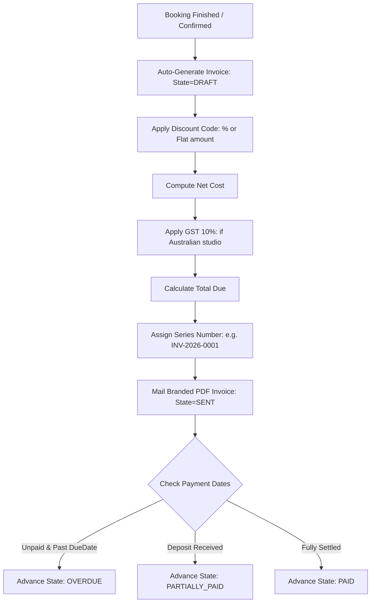

# ShutterFlow: Sprint 9 Plan — Invoicing System

## 🎯 Sprint Goal
Construct a high-end, customizable invoicing system capable of generating invoice series dynamically, managing discrete line items (quantities, unit costs, descriptions), parsing percentage or absolute discounts, applying Australian GST (10%) or other local taxes, supporting deposit/instalment structures, managing invoice lifecycles (`DRAFT` → `SENT` → `PARTIALLY_PAID` → `PAID` → `OVERDUE`), producing premium PDF files matching studio branding, and delivering invoices automatically via email.

---

## 🛠️ Tech Stack & Services
- **Backend Architecture**: Spring Boot 3.3.5, Thymeleaf (rich PDF generation layouts).
- **Relational Datastore**: MySQL 8.x with custom database locking on billing series.
- **Document Delivery**: OpenPDF / Flying Saucer and S3 cloud storage.
- **Communication Gateway**: SendGrid Java SDK with file attachments.

---

## 📊 Invoicing State Machine & Calculations

---

## 📅 Day-by-Day (Daily) Detailed Plan

### 📌 Day 1: Invoice Core Schema
- **Goal**: Model invoice structures and create corresponding table configurations.
- **Technical Steps**:
  - Implement `Invoice.java` JPA entity.
  - Link invoices to `Studio`, `Client`, and `Booking` elements.
  - Include fields for invoice number, issue date, due date, terms, status enum (`DRAFT`, `SENT`, `PARTIALLY_PAID`, `PAID`, `OVERDUE`), and financial summaries.

### 📌 Day 2: Mapped Invoice Line Items
- **Goal**: Model separate line items to list packages, print materials, and custom labor fees.
- **Technical Steps**:
  - Implement `InvoiceLineItem.java` entity as a `@OneToMany` child collection under `Invoice`.
  - Include item description, quantity, unit price, tax rate, and subtotal.
  - Map cascade removal so deleting an invoice wipes its line items automatically.

### 📌 Day 3: Custom Discount Rules & Code Engine
- **Goal**: Apply percentage-based or absolute currency discount rules to invoices.
- **Technical Steps**:
  - Structure `DiscountCode.java` entity validating expiration dates, usage limits, and discounts (e.g. 20% off or $100 off).
  - Implement an invoice recalculation routine adjusting totals upon applying codes.

### 📌 Day 4: Automated Sequential Invoice Numbering
- **Goal**: Auto-generate beautiful unique invoice series numbers (e.g. `INV-2026-0001`) preventing race conditions.
- **Technical Steps**:
  - Create a transaction-isolated method generating sequential integers for a studio namespace.
  - Use database transaction locks (`SELECT FOR UPDATE` or optimistic concurrency checks) on sequential generation.

### 📌 Day 5: Deposit and Instalment Payment Plans
- **Goal**: Allow partial billing, dividing invoice totals into a booking deposit and subsequent balance.
- **Technical Steps**:
  - Implement an `InvoicePaymentTerm` structure dividing payments into instalments (e.g., 30% booking deposit, 70% final balance).
  - Support tracking paid thresholds, advancing the invoice state to `PARTIALLY_PAID` once the deposit clears.

### 📌 Day 6: Overdue Invoice Scheduler
- **Goal**: Implement background workers tracking payment dates and automatically setting overdue statuses.
- **Technical Steps**:
  - Write a daily Spring `@Scheduled` cron job looking up active `SENT` or `PARTIALLY_PAID` invoices whose due dates have elapsed.
  - Advance status to `OVERDUE` and log auditing alerts.

### 📌 Day 7: Premium Invoice PDF Compiler
- **Goal**: Design gorgeous, professional invoice PDFs integrating studio logos and theme colors.
- **Technical Steps**:
  - Construct a Thymeleaf template mapping invoice properties, line items, and payment instructions.
  - Convert HTML output into beautiful PDFs via a Flying Saucer PDF compiler.

### 📌 Day 8: SendGrid Attachment Delivery
- **Goal**: Deliver generated invoice PDFs directly to clients' email addresses.
- **Technical Steps**:
  - Implement PDF archival storage in AWS S3 folder `/studios/{studioId}/invoices/`.
  - Build mail flows using SendGrid that download the S3 file stream and deliver it as a standard mail attachment.

### 📌 Day 9: Invoice CRUD & Validation Controls
- **Goal**: Implement invoice controllers secured by multi-tenant logic.
- **Technical Steps**:
  - Write `InvoiceController` exposing routes for draft creation, updates, and status overrides.
  - Validate parameters, blocking negative item counts or invalid due dates.

### 📌 Day 10: Invoicing System Integration Tests
- **Goal**: Write tests verifying serial sequence generators, tax math, and Sprint 9 DoD.
- **Technical Steps**:
  - Write MockMvc integration tests verifying:
    - Parallel invoice creations assign unique, non-overlapping serial numbers.
    - Discounts adjust final calculations accurately.
    - Overdue schedulers transition expired payments correctly.

---

## 🧪 Sprint 9 Definition of Done (DoD)
- [ ] Line items compute correct mathematical balances incorporating discounts and GST.
- [ ] Invoice sequence generator issues unique consecutive serials without gaps.
- [ ] Instalment configurations support split payments and partial states.
- [ ] Scheduled workers flag overdue invoices daily.
- [ ] PDF compiler renders branded invoice layouts and emails them as attachments.
- [ ] All integration tests pass successfully (`./gradlew test`).

follow shutterflow_sprint_plan.html
